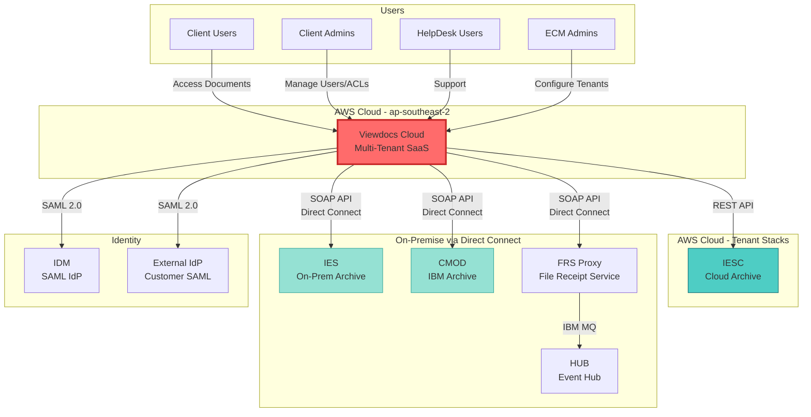
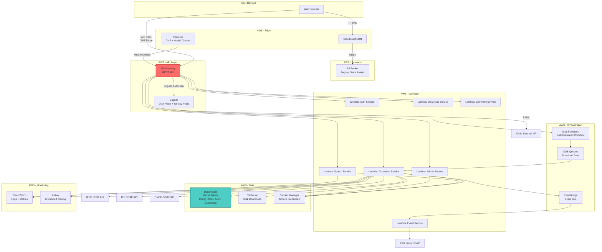
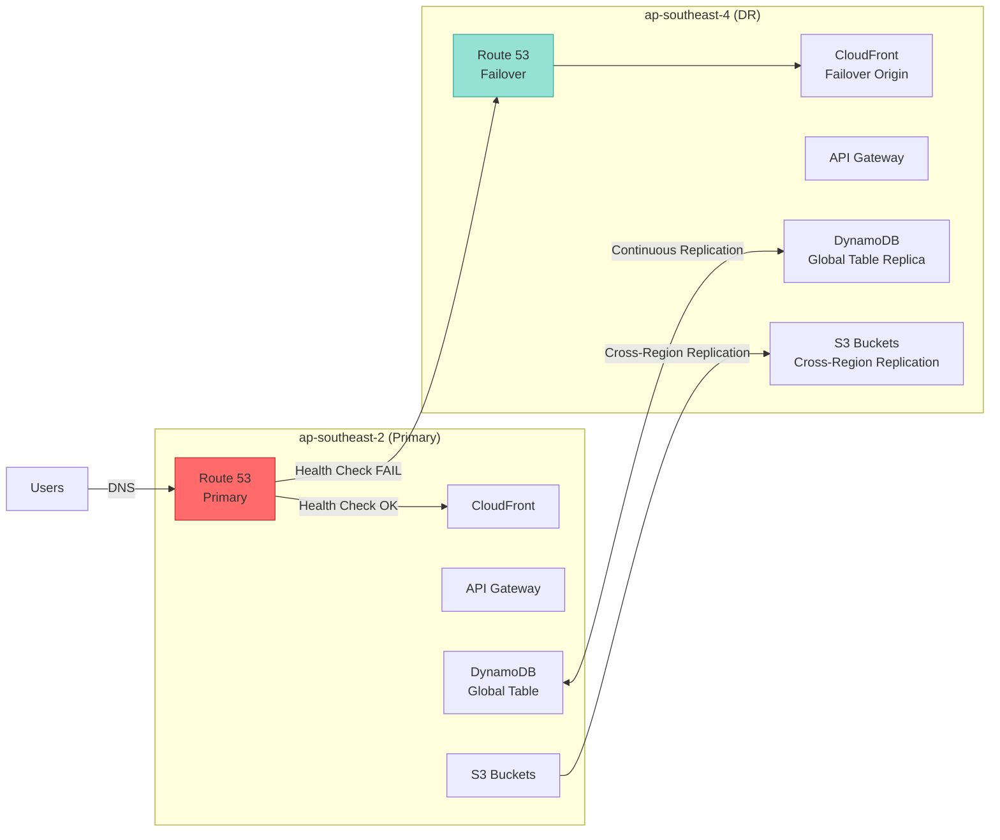

# Viewdocs Cloud Architecture - High-Level Solution Design (HLSD)

**Document Version:** 1.0
**Last Updated:** 2025-11-09
**Status:** Draft
**Author:** Architecture Team

---

## Executive Summary

This document presents the High-Level Solution Design (HLSD) for migrating the on-premise Viewdocs document management system to a cloud-native, serverless, multi-tenant architecture on AWS. The solution leverages AWS managed services to achieve scalability, resilience, and cost-efficiency while integrating with existing on-premise systems (IES, CMOD, FRS, HUB) and cloud-based systems (IESC, IDM).

### Key Highlights

- **Architecture Pattern:** Serverless, event-driven, multi-tenant (pool model)
- **Primary Region:** ap-southeast-2 (Sydney)
- **DR Region:** ap-southeast-4 (Melbourne) - Active-Passive failover
- **RPO/RTO:** 2 hours / 24 hours
- **Scale:** 500 concurrent users, 5-500 tenants, 10-1000 users per tenant
- **Tech Stack:** TypeScript, Node.js Lambda, Angular, DynamoDB, Cognito, API Gateway
- **Multi-Tenancy:** Pool model with logical isolation via tenant_id partitioning

---

## 1. Business Context

### 1.1 Purpose

Viewdocs provides FBDMS clients and internal users with secure access to documents stored across multiple archive systems:
- **IESC**: Cloud-based Enterprise Content Management (AWS, per-tenant stacks)
- **IES**: On-premise Enterprise Content Management (SOAP interface)
- **CMOD**: IBM on-premise document archive (SOAP interface)

The cloud migration aims to:
- Improve scalability and reduce infrastructure overhead
- Enable multi-tenant SaaS model for cost efficiency
- Leverage AWS managed services for resilience and security
- Maintain seamless integration with on-premise systems

### 1.2 Stakeholders

| Stakeholder | Interest |
|------------|----------|
| **FBDMS HelpDesk Users** | Support clients and internal consumers efficiently |
| **FBDMS ECM Admins** | Onboard tenants, manage archive configurations, monitor system health |
| **FBDMS Internal Consumers** | Access documents across all archives via unified interface |
| **Client Organization Administrators** | Manage users, assign folder access, configure ACLs |
| **Client Users** | View, download, search, comment on documents with appropriate permissions |

### 1.3 Key Business Capabilities

1. **Document Access**: View documents from IESC/IES/CMOD with ACL enforcement
2. **Search**: Index-based search (all archives), full-text search (IESC), conversational AI search (IESC - future)
3. **Download**: Single document download, bulk download (async, up to 5GB)
4. **Collaboration**: Add/edit comments on documents with version history
5. **Email Sharing**: Send documents via email
6. **Audit & Compliance**: Comprehensive logging with configurable retention
7. **Multi-Tenancy**: Isolated data and configuration per client organization

---

## 2. Architecture Principles

### 2.1 Cloud-Native Principles

1. **Serverless-First**: Use managed services (Lambda, DynamoDB, API Gateway) to eliminate infrastructure management
2. **Event-Driven**: Decouple services using EventBridge, SQS, Step Functions
3. **Immutable Infrastructure**: Infrastructure as Code (CDK), no manual changes
4. **Stateless Services**: Lambda functions are stateless, session state in Cognito/DynamoDB

### 2.2 Multi-Tenancy Principles

1. **Pool Model**: Shared infrastructure with logical isolation via tenant_id
2. **Tenant Isolation**: Strict data partitioning in DynamoDB, authorization checks in every request
3. **Noisy Neighbor Prevention**: Lambda concurrency limits, DynamoDB auto-scaling, per-tenant throttling
4. **Tenant Onboarding**: Self-service admin portal for tenant configuration

### 2.3 Security Principles

1. **Zero Trust**: Authenticate and authorize every request
2. **Data Residency**: All data in Australia (ap-southeast-2, ap-southeast-4)
3. **Encryption Everywhere**: At rest (KMS), in transit (TLS 1.2+)
4. **Least Privilege**: IAM roles with minimal permissions
5. **Audit Everything**: Immutable audit logs for compliance

### 2.4 Resilience Principles

1. **Multi-Region DR**: Active-Passive failover to ap-southeast-4
2. **Graceful Degradation**: Continue serving IESC if IES/CMOD unavailable
3. **Retry & Backoff**: Exponential backoff for archive API calls
4. **Circuit Breaker**: Prevent cascading failures from on-premise integrations

---

## 3. High-Level Architecture

### 3.1 System Context (C4 Level 1)

See [diagrams/context-diagram.md](diagrams/context-diagram.md) for detailed C4 Level 1 diagram.

### 3.2 Container Architecture (C4 Level 2)

See [diagrams/container-diagram.md](diagrams/container-diagram.md) for detailed C4 Level 2 diagram with draw.io reference.

---

## 4. Core Design Decisions

### 4.1 Multi-Tenancy: Pool vs Silo

**Decision:** Pool model with logical isolation

**Rationale:**
- **Cost Efficiency**: Shared infrastructure reduces AWS resource costs at scale (500 tenants)
- **Operational Simplicity**: Single deployment pipeline, centralized monitoring
- **Isolation via Design**: DynamoDB partition keys, authorization middleware, tenant_id in all queries
- **Scalability**: Lambda auto-scaling handles all tenants, no per-tenant resource provisioning

**Trade-offs:**
- More complex authorization logic vs silo
- Requires robust noisy neighbor prevention (concurrency limits, throttling)

See [10-decision-log.md#ADR-001](10-decision-log.md#adr-001) for full ADR.

### 4.2 Authentication: Cognito vs Custom

**Decision:** AWS Cognito with SAML federation

**Rationale:**
- **SAML 2.0 Support**: Integrates with IDM and external customer IdPs
- **Managed Service**: No custom JWT issuance, token rotation, session management
- **Hosted UI**: Optional UI for login, customizable per tenant
- **MFA Support**: Managed by IdP (IDM or external)

**Implementation:**
- Single Cognito User Pool with multiple SAML IdP connections
- Subdomain-based IdP routing (tenant1.viewdocs.example.com → IDM or ExternalIdP)
- JWT tokens validated by API Gateway Cognito authorizer

See [10-decision-log.md#ADR-002](10-decision-log.md#adr-002).

### 4.3 Database: DynamoDB vs RDS/Aurora

**Decision:** DynamoDB with Global Tables

**Rationale:**
- **Serverless**: Auto-scaling, no server management
- **Multi-Region Replication**: Global Tables for active-active replication to DR region
- **Performance**: Single-digit millisecond latency, predictable at scale
- **Cost**: On-demand pricing for dev/UAT, provisioned for prod

**Data Model:** Single-table design with tenant_id as partition key prefix

**Trade-offs:**
- NoSQL learning curve vs relational
- Requires careful access pattern design upfront

See [03-data-architecture.md](03-data-architecture.md) for schema details.

### 4.4 Archive Integration: Direct vs Queue-Based

**Decision:** Direct synchronous calls for search/view, async for bulk download

**Rationale:**
- **User Experience**: Real-time search/view requires low latency (<2s)
- **Resilience**: Retry logic in Lambda for transient failures
- **Bulk Downloads**: Step Functions + SQS for long-running aggregation (5GB, 15min+)

**Hybrid Approach:**
- Document view/search: Lambda → Archive API (with timeout 29s)
- Bulk download: API Gateway → Step Functions → SQS → Lambda (per document) → S3 → Email notification

See [02-application-architecture.md](02-application-architecture.md) for flow diagrams.

### 4.5 Event Processing: EventBridge vs SQS/SNS

**Decision:** EventBridge for HUB integration, SQS for bulk downloads

**Rationale:**
- **EventBridge**: Schema registry, content-based filtering, multiple targets (FRS Proxy, future analytics)
- **SQS**: FIFO guarantee for bulk download job ordering, dead-letter queue for retries

See [10-decision-log.md#ADR-005](10-decision-log.md#adr-005).

---

## 5. Non-Functional Requirements

### 5.1 Performance

| Metric | Target | Measurement |
|--------|--------|-------------|
| **API Latency (p95)** | <500ms | CloudWatch API Gateway metrics |
| **Document View Latency (p95)** | <2s | End-to-end from API call to document render |
| **Search Results (p95)** | <1s | Time to return first page of results |
| **Bulk Download Job Start** | <5s | Time to initiate Step Functions workflow |
| **Concurrent Users** | 500 | Load test with Artillery/Locust |

### 5.2 Availability & Resilience

| Metric | Target | Implementation |
|--------|--------|----------------|
| **Uptime SLA** | 99.9% (43.8min downtime/month) | Multi-AZ, Route 53 health checks, auto-scaling |
| **RPO** | 2 hours | DynamoDB Global Tables (continuous replication) |
| **RTO** | 24 hours | Route 53 failover to ap-southeast-4, tested quarterly |
| **Archive Unavailability** | Graceful degradation | Show cached data + error message, retry after 1min |

### 5.3 Scalability

| Dimension | Baseline | Growth | Implementation |
|-----------|----------|--------|----------------|
| **Tenants** | 5 | 500 | DynamoDB scales horizontally, Lambda auto-scales |
| **Users/Tenant** | 10-1000 | N/A | Cognito supports millions of users |
| **Concurrent Users** | 500 | 2000 | Lambda reserved concurrency, API Gateway throttling |
| **Documents/Search** | 1000 results | 10,000 results | Pagination, CloudFront caching |

### 5.4 Security & Compliance

| Requirement | Implementation |
|-------------|----------------|
| **Data Residency** | All data in ap-southeast-2 / ap-southeast-4 (Australia) |
| **Encryption at Rest** | DynamoDB (KMS), S3 (KMS), Secrets Manager (KMS) |
| **Encryption in Transit** | TLS 1.2+ (API Gateway, CloudFront, Direct Connect) |
| **Authentication** | Cognito with SAML 2.0, MFA via IdP |
| **Authorization** | Role-based access control (RBAC), ACLs in DynamoDB |
| **Audit Logs** | All document operations logged to DynamoDB with TTL (6mo prod, 1mo UAT, 1wk dev) |
| **Secrets Management** | AWS Secrets Manager with auto-rotation |
| **Compliance** | Australian Privacy Act, WORM audit logs for immutability |

---

## 6. Integration Architecture

### 6.1 Archive Systems

| System | Type | Interface | Connectivity | Operations |
|--------|------|-----------|--------------|-----------|
| **IESC** | Cloud (AWS) | REST API | VPC Peering / PrivateLink | Search (index, full-text, conversational), GetDocument, GetMetadata |
| **IES** | On-Premise | SOAP | Direct Connect | Search (index), GetDocument, GetMetadata |
| **CMOD** | On-Premise (IBM) | SOAP | Direct Connect | Search (index), GetDocument, GetMetadata |

**Common Pattern:** Archive abstraction layer (TypeScript interface) with concrete implementations (IESCClient, IESClient, CMODClient)

### 6.2 On-Premise Systems

| System | Purpose | Interface | Integration Pattern |
|--------|---------|-----------|---------------------|
| **FRS Proxy** | Message routing to HUB via IBM MQ | SOAP | Lambda → FRS Proxy (Direct Connect) |
| **HUB** | Event aggregation | IBM MQ | FRS Proxy forwards events from Viewdocs |
| **IDM** | Identity Provider | SAML 2.0 | Cognito SAML federation |
| **IDM Email Service** | Send emails | REST/SOAP | Lambda → IDM Email Service |

### 6.3 Future Integrations

| System | Timeline | Purpose |
|--------|----------|---------|
| **Email Platform** | 3 months | Self-service email sending via REST endpoint |
| **AWS Bedrock (RAG)** | 6-12 months | Conversational AI search enhancement |
| **CIP (Cloud Imaging Platform)** | TBD | OCR, classification, extraction (via IESC) |

---

## 7. Deployment Architecture

### 7.1 Multi-Region Topology

### 7.2 Environment Strategy

| Environment | Account | Purpose | Deployment Trigger |
|-------------|---------|---------|-------------------|
| **Dev** | dev-account | Rapid iteration, feature development | Auto-deploy on commit to `develop` branch |
| **UAT** | uat-account | Client acceptance testing, integration testing | Manual approval from `develop` branch |
| **Prod** | prod-account | Production workloads | Manual approval from `main` branch with blue-green |

### 7.3 CI/CD Pipeline

1. **Build**: TypeScript compilation, unit tests (Jest), linting (ESLint)
2. **Synth**: CDK synth → CloudFormation templates
3. **Deploy Dev**: Auto-deploy to dev environment, integration tests
4. **Manual Approval**: Tech lead approves UAT deployment
5. **Deploy UAT**: E2E tests (Cypress), load tests (Artillery)
6. **Manual Approval**: Product owner approves prod deployment
7. **Deploy Prod**: Blue-green deployment with canary rollout (10% → 100%)

See [06-deployment-architecture.md](06-deployment-architecture.md) for detailed pipeline.

---

## 8. Cost Model

### 8.1 Estimated Monthly Cost (Production)

| Service | Usage | Unit Cost (ap-southeast-2) | Monthly Cost (USD) |
|---------|-------|----------------------------|---------------------|
| **API Gateway** | 10M requests | $3.50/1M | $35 |
| **Lambda** | 50M requests, 512MB, 500ms avg | $0.20/1M requests + $0.0000166667/GB-sec | $350 |
| **DynamoDB** | 100GB, 10M read, 5M write (provisioned) | $0.329/GB + $0.000742/read + $0.003710/write | $60 |
| **S3** | 500GB storage, 5M GET, 1M PUT | $0.025/GB + $0.0004/1K GET + $0.005/1K PUT | $15 |
| **CloudFront** | 1TB data transfer, 10M requests | $0.140/GB + $0.0120/10K requests | $152 |
| **Cognito** | 5000 MAU | $0.00550/MAU (beyond 50K free tier) | Free (below 50K) |
| **Direct Connect** | Shared 10Gbps | Amortized across FBDMS systems | $50 (amortized) |
| **Secrets Manager** | 50 secrets | $0.40/secret/month | $20 |
| **CloudWatch** | 50GB logs, 1000 metrics | $0.57/GB + $0.30/metric | $329 |
| **X-Ray** | 10M traces | $5/1M traces | $50 |
| **Route 53** | 2 hosted zones, 10M queries | $0.50/zone + $0.40/1M queries | $5 |
| **Step Functions** | 100K state transitions | $0.025/1K transitions | $2.50 |
| **Total (Single Region)** | | | **~$1,068** |
| **DR Region (ap-southeast-4)** | 20% of primary (standby) | | **~$214** |
| **Grand Total** | | | **~$1,282/month** |

**Notes:**
- Costs scale with tenant count and usage
- Reserved capacity for Lambda/DynamoDB can reduce costs by 30-50% at steady state
- Cross-region data transfer not included (depends on failover frequency)

See [08-cost-architecture.md](08-cost-architecture.md) for detailed cost analysis and optimization strategies.

---

## 9. Migration Strategy

### 9.1 Phases

| Phase | Duration | Scope |
|-------|----------|-------|
| **Phase 0: Foundation** | 4 weeks | CDK setup, CI/CD pipeline, networking (Direct Connect), IAM roles |
| **Phase 1: Core Services** | 8 weeks | Authentication (Cognito + IDM SAML), DynamoDB schema, Lambda functions (document, search, admin) |
| **Phase 2: Archive Integration** | 6 weeks | IESC/IES/CMOD clients, FRS Proxy, HUB EventBridge integration |
| **Phase 3: Frontend** | 8 weeks | Angular app, CloudFront distribution, document viewer |
| **Phase 4: Advanced Features** | 6 weeks | Bulk download (Step Functions), comments, email integration |
| **Phase 5: UAT** | 4 weeks | Load testing, security testing, client UAT with 2 pilot tenants |
| **Phase 6: Production** | 2 weeks | Blue-green deployment, tenant migration (5 → 50 → 500) |

**Total:** ~38 weeks (~9 months)

### 9.2 Migration Approach

- **Greenfield Deployment**: New cloud stack, no migration of existing on-premise Viewdocs data
- **Tenant Onboarding**: ECM admins configure archive endpoints in new cloud Viewdocs admin portal
- **User Migration**: Users redirected to new cloud URL (tenant.viewdocs.cloud.example.com) via DNS cutover
- **Rollback**: Keep on-premise Viewdocs running in parallel for first 3 months

---

## 10. Risk & Mitigation

| Risk | Impact | Likelihood | Mitigation |
|------|--------|------------|------------|
| **Direct Connect Latency** | High | Medium | Monitor latency, consider caching archive metadata in DynamoDB |
| **Lambda Cold Starts** | Medium | High | Provisioned concurrency for latency-sensitive functions, optimize package size |
| **DynamoDB Hot Partitions** | High | Medium | Design partition keys with high cardinality (tenant_id + random suffix for audit logs) |
| **Archive API Downtime** | High | Low | Retry logic, circuit breaker, cached data, graceful error messages |
| **Cost Overrun** | Medium | Medium | CloudWatch billing alarms, Lambda timeout guards, S3 lifecycle policies |
| **Security Breach** | High | Low | WAF on API Gateway/CloudFront, Secrets Manager rotation, GuardDuty monitoring |
| **Multi-Tenant Data Leakage** | High | Low | Code reviews, integration tests for tenant isolation, penetration testing |

---

## 11. Success Criteria

| Criteria | Measurement | Target |
|----------|-------------|--------|
| **Performance** | API latency p95 | <500ms |
| **Availability** | Uptime % | 99.9% |
| **Cost** | Monthly AWS bill (500 tenants) | <$2000/month |
| **Adoption** | Tenants migrated in 6 months | 50+ |
| **User Satisfaction** | NPS score | >50 |
| **Security** | Zero data breaches | 100% |

---

## 12. Next Steps

1. **Review & Approval**: Architecture review board approval
2. **Detailed Design**: Complete remaining architecture documents (sections 1-10)
3. **CDK Setup**: Bootstrap AWS accounts, create foundation stacks
4. **POC**: Build minimal viable product with 1 tenant, IESC integration, basic search
5. **UAT Planning**: Identify 2 pilot tenants for UAT
6. **Team Onboarding**: Train developers on AWS, CDK, TypeScript, DynamoDB

---

## 13. References

- [01-business-architecture.md](01-business-architecture.md) - Business drivers, use cases
- [02-application-architecture.md](02-application-architecture.md) - Application components, APIs
- [03-data-architecture.md](03-data-architecture.md) - DynamoDB schema, data flows
- [04-technology-architecture.md](04-technology-architecture.md) - AWS services, tech stack
- [05-security-architecture.md](05-security-architecture.md) - Security controls, compliance
- [06-deployment-architecture.md](06-deployment-architecture.md) - CI/CD, environments
- [07-infrastructure-architecture.md](07-infrastructure-architecture.md) - Network, compute, storage
- [08-cost-architecture.md](08-cost-architecture.md) - Cost model, optimization
- [10-decision-log.md](10-decision-log.md) - Architecture Decision Records (ADRs)

---

**Document Control**

| Version | Date | Author | Changes |
|---------|------|--------|---------|
| 1.0 | 2025-11-09 | Architecture Team | Initial HLSD draft |
