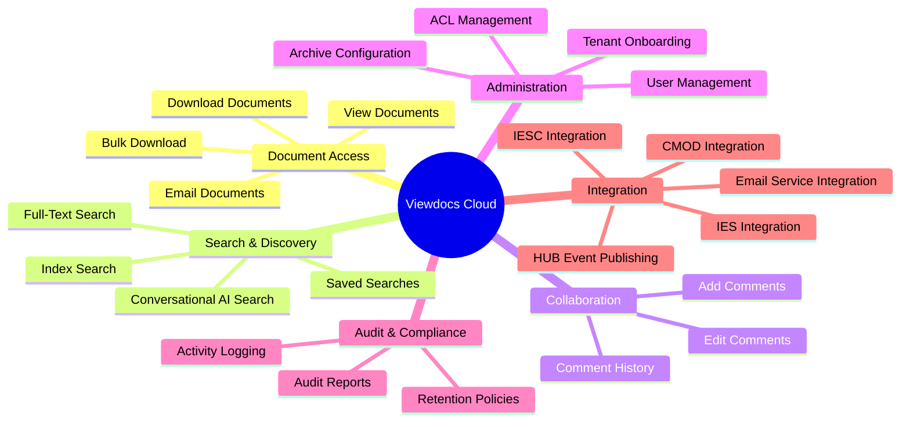
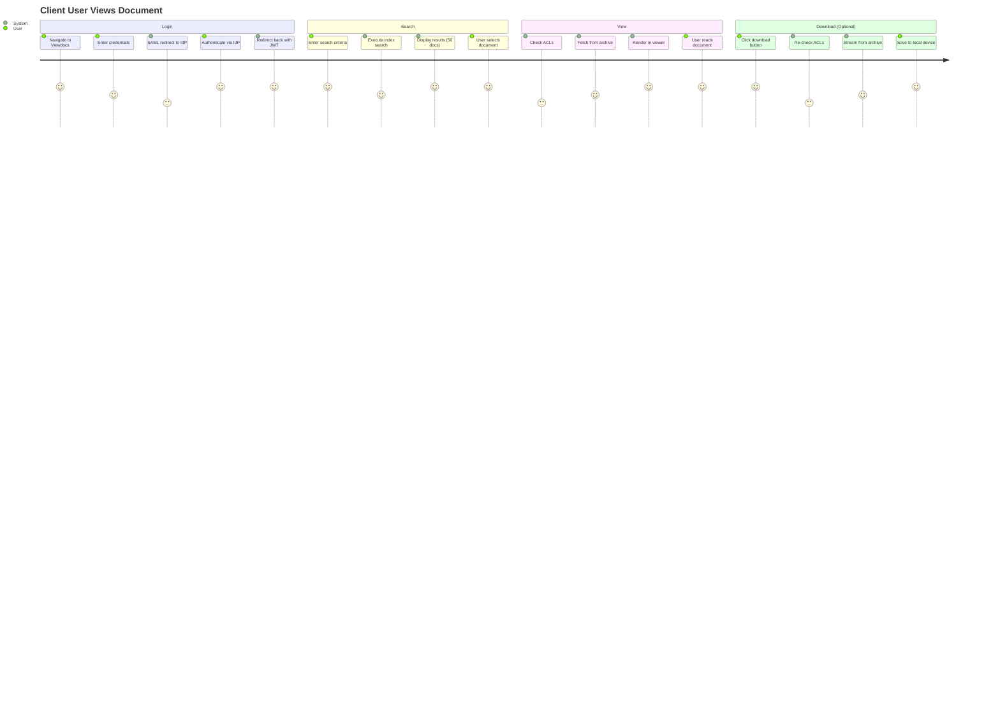

# Business Architecture

**Document Version:** 1.0
**Last Updated:** 2025-11-09
**Status:** Draft

---

## 1. Business Context

### 1.1 Business Problem

FBDMS clients and internal users require access to documents stored across heterogeneous archive systems (IESC, IES, CMOD). The current on-premise Viewdocs system:
- **High Infrastructure Cost**: Dedicated servers, Oracle database licensing, maintenance overhead
- **Limited Scalability**: Cannot easily onboard new clients without hardware provisioning
- **Single Point of Failure**: No disaster recovery, limited high availability
- **Operational Complexity**: Manual deployments, patching, monitoring across multiple environments

### 1.2 Business Objectives

| Objective | Success Metric | Timeline |
|-----------|----------------|----------|
| **Reduce Infrastructure Costs** | 40% reduction in total cost of ownership | 12 months post-migration |
| **Improve Scalability** | Onboard 100+ new tenants without infrastructure changes | 6 months |
| **Increase Availability** | 99.9% uptime SLA | 3 months post-production |
| **Accelerate Time-to-Market** | Reduce tenant onboarding from 2 weeks to 24 hours | 6 months |
| **Enhance Security & Compliance** | Zero security incidents, pass annual audit | Ongoing |

### 1.3 Business Drivers

1. **Cloud-First Strategy**: FBDMS enterprise mandate to migrate workloads to AWS
2. **Multi-Tenant SaaS Model**: Amortize infrastructure costs across 500+ clients
3. **Hybrid Cloud Integration**: Leverage cloud services while maintaining on-premise archive investments
4. **User Experience**: Modern Angular UI, sub-second search, mobile-responsive design
5. **Compliance**: Australian data residency, encryption, audit trail for regulated industries

---

## 2. Stakeholder Analysis

### 2.1 Primary Stakeholders

| Stakeholder | Role | Goals | Pain Points (Current System) |
|-------------|------|-------|------------------------------|
| **Client Users** | End users accessing documents | Fast search, easy download, intuitive UI | Slow search (>5s), outdated UI, mobile not supported |
| **Client Admins** | Manage users, folders, ACLs per organization | Self-service user management, granular permissions | Manual user onboarding, limited ACL granularity |
| **FBDMS HelpDesk** | L1/L2 support for clients | Quick issue resolution, troubleshooting tools | No centralized logging, difficult to diagnose issues |
| **FBDMS ECM Admins** | Onboard tenants, configure archives | Rapid tenant onboarding, monitoring dashboard | Manual configuration, no visibility into archive health |
| **FBDMS Internal Users** | Access documents for business operations | Unified search across all archives | Different UIs for IESC vs IES vs CMOD |

### 2.2 Secondary Stakeholders

| Stakeholder | Role | Interest |
|-------------|------|----------|
| **FBDMS Finance** | Budget allocation | Reduce operational costs, predictable cloud spend |
| **FBDMS Security** | Compliance, audit | Encryption, access logs, data residency compliance |
| **FBDMS IT Infrastructure** | AWS platform management | Standardized AWS services, Infrastructure as Code |
| **Archive Vendors** | IESC, IES, CMOD providers | API stability, partnership for integrations |

---

## 3. Business Capabilities

### 3.1 Capability Map

### 3.2 Detailed Capabilities

#### 3.2.1 Document Access Capabilities

| Capability | Description | Users | Priority |
|------------|-------------|-------|----------|
| **View Documents** | Render documents in browser (PDF, images, Office docs) | All users | Critical |
| **Download Single Document** | Download document to local device with ACL check | All users | Critical |
| **Bulk Download** | Async download of up to 5GB, email notification on completion | All users | High |
| **Email Documents** | Send document via email to specified recipients | Client users, internal users | High |

**Business Rules:**
- ACLs enforced at folder and document level
- Download activity logged for audit
- Bulk download jobs expire after 72 hours (configurable)

#### 3.2.2 Search & Discovery Capabilities

| Capability | Description | Archive Support | Priority |
|------------|-------------|-----------------|----------|
| **Index Search** | Search by metadata fields (doc ID, date, customer ID, etc.) | IESC, IES, CMOD | Critical |
| **Full-Text Search** | Search document content (OCR'd text) | IESC only | High |
| **Conversational AI Search** | Natural language queries (e.g., "invoices for ACME Corp in Q4 2024") | IESC only (future) | Medium |
| **Saved Searches** | Save frequent search criteria for quick access | All archives | Low |

**Business Rules:**
- Search results filtered by user's folder access (ACLs)
- Pagination: 50 results per page default, configurable up to 500
- Search timeout: 30 seconds, return partial results if archive slow

#### 3.2.3 Collaboration Capabilities

| Capability | Description | Storage | Priority |
|------------|-------------|---------|----------|
| **Add Comments** | Add text comments to documents | DynamoDB | High |
| **Edit Comments** | Modify own comments within 24 hours of creation | DynamoDB | Medium |
| **Comment History** | View version history of edited comments | DynamoDB | Medium |
| **@Mentions** | Notify users via @mention in comments | DynamoDB + Email | Low (future) |

**Business Rules:**
- Only users with document view access can comment
- Comment edit window: 24 hours (configurable per tenant)
- Comments stored in Viewdocs, not in archive systems

#### 3.2.4 Administration Capabilities

| Capability | Description | User Role | Priority |
|------------|-------------|-----------|----------|
| **Tenant Onboarding** | Create new tenant, configure archive endpoints, branding | ECM Admin | Critical |
| **User Management** | Invite users, assign roles, deactivate users | Client Admin | Critical |
| **ACL Management** | Define folder-level permissions per role | Client Admin | Critical |
| **Archive Configuration** | Add/edit IESC/IES/CMOD connection settings | ECM Admin | Critical |
| **Monitoring Dashboard** | View tenant health, usage metrics, error rates | ECM Admin, HelpDesk | High |

**Business Rules:**
- ECM Admins can manage all tenants
- Client Admins can only manage their own tenant
- ACL changes audit-logged and take effect immediately

#### 3.2.5 Audit & Compliance Capabilities

| Capability | Description | Retention | Priority |
|------------|-------------|-----------|----------|
| **Activity Logging** | Log all document views, downloads, searches, comments | 6mo prod, 1mo UAT, 1wk dev | Critical |
| **Audit Reports** | Generate CSV/PDF reports of user activity | On-demand | High |
| **Retention Policies** | Auto-delete logs based on environment TTL | DynamoDB TTL | Critical |
| **WORM Compliance** | Immutable audit logs (write-once, read-many) | S3 Object Lock (future) | Medium |

**Business Rules:**
- All events include: timestamp, tenant_id, user_id, resource_id, action, IP address
- Audit logs cannot be modified or deleted before retention period
- Compliance reports available to Client Admins for their tenant only

---

## 4. Business Processes

### 4.1 User Journey: Client User Views Document

### 4.2 Use Case: UC-001 View Document

| Field | Value |
|-------|-------|
| **Use Case ID** | UC-001 |
| **Name** | View Document |
| **Primary Actor** | Client User |
| **Stakeholders** | Client User (wants fast, secure access), FBDMS (wants audit trail) |
| **Preconditions** | User authenticated, has folder access, document exists in archive |
| **Postconditions** | Document displayed in browser, view event logged |
| **Trigger** | User clicks document in search results |

**Main Success Scenario:**
1. User searches for documents using index search
2. System displays paginated results (50 per page)
3. User clicks document title
4. System validates user's ACL for document's folder
5. System fetches document from archive (IESC/IES/CMOD)
6. System renders document in browser viewer
7. System logs view event to DynamoDB (tenant_id, user_id, doc_id, timestamp)
8. System publishes event to EventBridge → FRS → HUB

**Extensions:**
- **4a. User lacks ACL permission**
  - 4a1. System displays "Access Denied" message
  - 4a2. System logs unauthorized access attempt
  - 4a3. Use case ends
- **5a. Archive unavailable (timeout/error)**
  - 5a1. System retries 3 times with exponential backoff
  - 5a2. If still failing, display "Document temporarily unavailable"
  - 5a3. System logs error with archive endpoint, response time
  - 5a4. Use case ends

### 4.3 Use Case: UC-002 Bulk Download

| Field | Value |
|-------|-------|
| **Use Case ID** | UC-002 |
| **Name** | Bulk Download Documents |
| **Primary Actor** | Client User |
| **Preconditions** | User authenticated, selected documents have ACL access |
| **Postconditions** | Zip file available in S3, email sent with download link |
| **Trigger** | User selects multiple documents and clicks "Bulk Download" |

**Main Success Scenario:**
1. User selects up to 500 documents from search results
2. User clicks "Bulk Download" button
3. System validates total size < 5GB
4. System initiates Step Functions workflow
5. System returns job ID to user, displays "Processing..." message
6. Step Functions fans out document fetches to SQS
7. Lambda functions (concurrency=1) fetch each document from archive
8. Lambda aggregates documents into zip file in S3
9. System generates download URL (protected by user session)
10. System sends email to user with download link (expires in 72 hours)
11. User clicks link in email, downloads zip file

**Extensions:**
- **3a. Total size > 5GB**
  - 3a1. System displays error "Bulk download limited to 5GB, please reduce selection"
  - 3a2. Use case ends
- **7a. Archive fetch fails for one or more documents**
  - 7a1. Lambda retries 3 times
  - 7a2. If still failing, skip document and log error
  - 7a3. Continue with remaining documents
  - 7a4. Email includes list of failed documents
- **10a. Email send fails**
  - 10a1. Retry email send after 5 minutes
  - 10a2. If retry fails, log error
  - 10a3. User can check job status in Viewdocs UI

### 4.4 Use Case: UC-003 Onboard New Tenant

| Field | Value |
|-------|-------|
| **Use Case ID** | UC-003 |
| **Name** | Onboard New Tenant |
| **Primary Actor** | ECM Admin |
| **Preconditions** | ECM Admin authenticated, archive endpoints available |
| **Postconditions** | Tenant active, Client Admin can login and configure users |
| **Trigger** | Sales team signs new client contract |

**Main Success Scenario:**
1. ECM Admin logs into Viewdocs Admin Portal
2. ECM Admin clicks "Add New Tenant"
3. ECM Admin enters:
   - Tenant name, subdomain (e.g., "acme" → acme.viewdocs.example.com)
   - Archive type (IESC/IES/CMOD)
   - Archive endpoint URL, credentials (stored in Secrets Manager)
   - IdP selection (IDM or external SAML IdP metadata)
   - Branding (logo, color scheme)
4. System validates subdomain uniqueness
5. System tests archive connection
6. System creates DynamoDB records:
   - TENANT#<tenantId> CONFIG#archive
   - TENANT#<tenantId> CONFIG#branding
7. System configures Cognito SAML IdP connection
8. System creates CloudFront origin for tenant subdomain
9. System sends welcome email to Client Admin with login link
10. Client Admin logs in, configures users and ACLs

**Extensions:**
- **4a. Subdomain already exists**
  - 4a1. System displays error "Subdomain taken, please choose another"
  - 4a2. Return to step 3
- **5a. Archive connection test fails**
  - 5a1. System displays error with details (timeout, auth failure, etc.)
  - 5a2. ECM Admin corrects endpoint/credentials
  - 5a3. Return to step 5

---

## 5. Business Rules

### 5.1 Access Control Rules

| Rule ID | Rule | Enforcement Point |
|---------|------|-------------------|
| **BR-001** | Users can only access documents in folders assigned to their role | Lambda: Document Service ACL check |
| **BR-002** | Client Admins can only manage users within their own tenant | Lambda: Admin Service tenant validation |
| **BR-003** | ECM Admins can manage all tenants | Lambda: Admin Service role check |
| **BR-004** | Bulk download limited to 5GB total size | Lambda: Download Service pre-flight check |
| **BR-005** | Comments can only be edited within 24 hours of creation | Lambda: Comment Service timestamp check |

### 5.2 Data Retention Rules

| Rule ID | Rule | Implementation |
|---------|------|----------------|
| **BR-010** | Audit logs retained for 6 months (prod), 1 month (UAT), 1 week (dev) | DynamoDB TTL attribute |
| **BR-011** | Bulk download files deleted after 72 hours | S3 Lifecycle Policy |
| **BR-012** | User sessions expire after 30 minutes of inactivity | Cognito session timeout |
| **BR-013** | Failed login attempts logged for 90 days | DynamoDB TTL attribute |

### 5.3 Integration Rules

| Rule ID | Rule | Enforcement Point |
|---------|------|-------------------|
| **BR-020** | All document operations published to HUB within 5 seconds | EventBridge → FRS Proxy |
| **BR-021** | Archive API calls timeout after 29 seconds | Lambda timeout configuration |
| **BR-022** | Archive API failures retried 3 times with exponential backoff | Lambda retry logic |
| **BR-023** | SAML assertions validated against IdP public certificate | Cognito SAML configuration |

---

## 6. Business Value & ROI

### 6.1 Cost-Benefit Analysis

| Category | Current State (On-Premise) | Future State (Cloud) | Annual Savings |
|----------|----------------------------|----------------------|----------------|
| **Infrastructure** | $120K/year (servers, Oracle licenses, data center) | $18K/year (AWS services) | $102K |
| **Operations** | $80K/year (2 FTE for maintenance, patching) | $20K/year (0.5 FTE for monitoring) | $60K |
| **Disaster Recovery** | $0 (no DR currently) | $3K/year (ap-southeast-4 standby) | -$3K |
| **Development Velocity** | 4 weeks/feature (manual deployment, testing) | 1 week/feature (CI/CD, automated tests) | ~$100K/year (opportunity cost) |
| **Total** | $200K/year | $41K/year | **$159K/year** |

**ROI Calculation:**
- Initial investment: $400K (9 months development, migration)
- Annual savings: $159K
- Payback period: **2.5 years**
- 5-year NPV (10% discount rate): **$203K**

### 6.2 Non-Financial Benefits

1. **Scalability**: Onboard 500+ tenants without incremental infrastructure cost
2. **Reliability**: 99.9% uptime vs current 95% uptime
3. **User Experience**: Modern UI, sub-second search, mobile support
4. **Compliance**: Australian data residency, automated audit reports
5. **Innovation**: Foundation for AI-powered search (AWS Bedrock), analytics

---

## 7. Key Performance Indicators (KPIs)

| KPI | Current | Target (6 months) | Measurement |
|-----|---------|-------------------|-------------|
| **Tenant Count** | 5 (on-premise) | 50 | DynamoDB tenant table count |
| **User Count** | 500 | 5,000 | Cognito user pool metrics |
| **Avg. Search Latency** | 5.2s | <1s | CloudWatch p95 latency |
| **System Uptime** | 95% | 99.9% | CloudWatch availability metrics |
| **Helpdesk Tickets (per month)** | 120 | <50 | ServiceNow ticket count |
| **Cost per Tenant (monthly)** | $2,000 | <$100 | AWS Cost Explorer + allocation tags |

---

## 8. Success Criteria

### 8.1 Go-Live Criteria

- [ ] 2 pilot tenants successfully onboarded and tested in UAT
- [ ] All use cases (UC-001 to UC-003) passing E2E tests
- [ ] Performance benchmarks met (p95 latency <500ms)
- [ ] Security audit passed (penetration testing, compliance review)
- [ ] DR failover tested successfully (RTO <24 hours)
- [ ] Runbook and support documentation complete

### 8.2 Post-Launch Criteria (3 months)

- [ ] 20+ tenants migrated to cloud
- [ ] Zero critical incidents (P1/P2)
- [ ] User satisfaction score >80%
- [ ] Cost per tenant <$150/month
- [ ] On-premise Viewdocs decommissioned

---

## 9. Assumptions & Dependencies

### 9.1 Assumptions

1. **Archive Stability**: IESC/IES/CMOD APIs remain stable with <5% breaking changes per year
2. **Direct Connect**: Existing Direct Connect has sufficient bandwidth (10Gbps) and <50ms latency
3. **User Adoption**: 80% of users will adopt cloud Viewdocs within 6 months
4. **IdP Integration**: All client IdPs support SAML 2.0

### 9.2 Dependencies

| Dependency | Owner | Status | Risk |
|------------|-------|--------|------|
| **AWS Account Setup** | FBDMS IT | In Progress | Low |
| **Direct Connect Provisioning** | FBDMS Network Team | Complete | Low |
| **IDM SAML Configuration** | IDM Team | Not Started | Medium |
| **IESC API Documentation** | IESC Vendor | Complete | Low |
| **FRS Proxy Deployment** | FRS Team | In Progress | Medium |

---

## 10. Constraints

1. **Data Residency**: All data must remain in Australia (ap-southeast-2, ap-southeast-4)
2. **Budget**: Total project budget $500K (development + 12 months operations)
3. **Timeline**: Production launch within 9 months
4. **Security**: No sensitive data (customer PII, financial records) in CloudWatch logs
5. **Technology**: Must use AWS services approved by FBDMS IT (no third-party SaaS tools)

---

## Next Steps

1. Review business architecture with stakeholders
2. Validate use cases with pilot tenant (2-week sprint)
3. Finalize business rules in collaboration with compliance team
4. Proceed to [02-application-architecture.md](02-application-architecture.md) for technical design

---

**Document Control**

| Version | Date | Author | Changes |
|---------|------|--------|---------|
| 1.0 | 2025-11-09 | Architecture Team | Initial business architecture draft |
