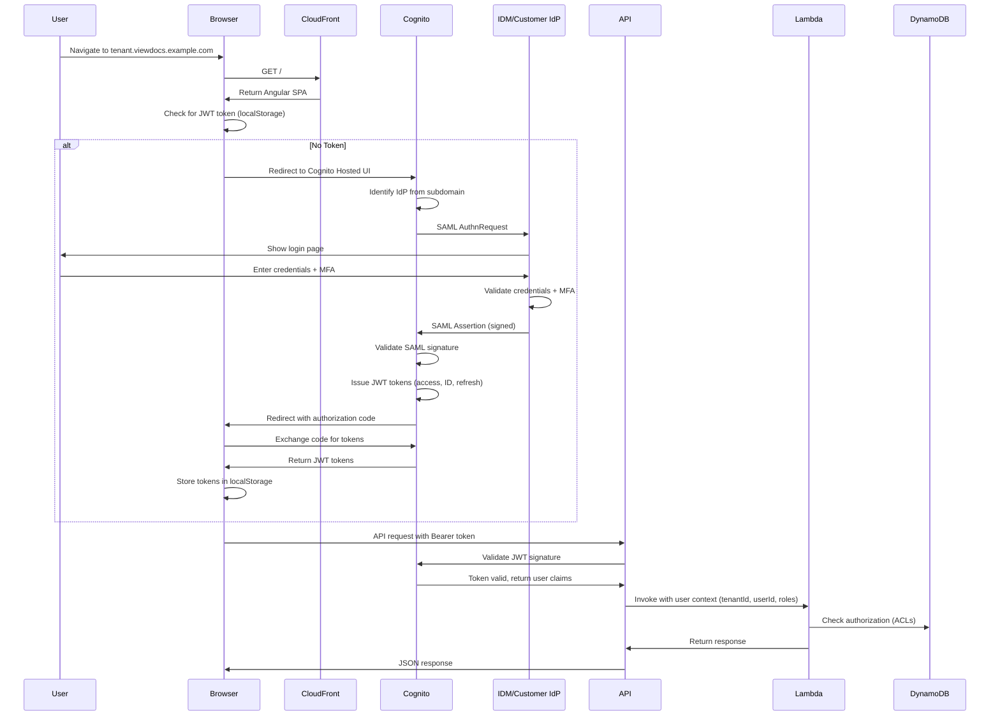
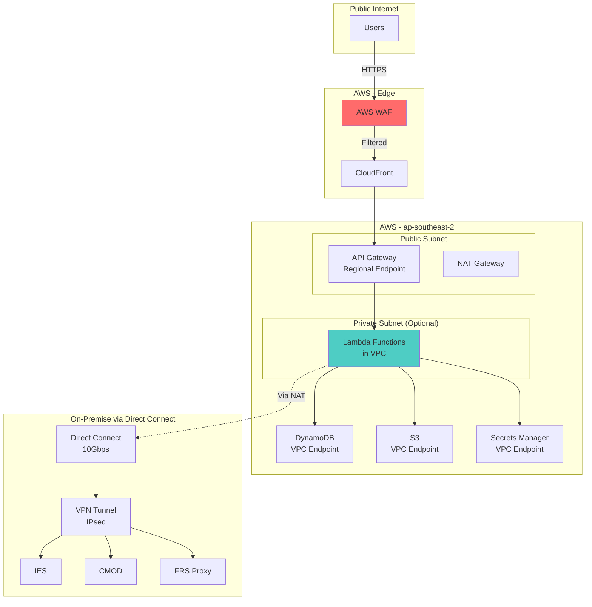

# Security Architecture

**Document Version:** 1.0
**Last Updated:** 2025-11-09
**Status:** Draft

---

## 1. Security Overview

### 1.1 Security Principles

1. **Defense in Depth**: Multiple layers of security controls
2. **Zero Trust**: Verify every request, never trust by default
3. **Least Privilege**: Grant minimum permissions required
4. **Encryption Everywhere**: Data encrypted at rest and in transit
5. **Audit Everything**: Comprehensive logging for compliance and forensics

### 1.2 Compliance Requirements

| Requirement | Standard | Implementation |
|-------------|----------|----------------|
| **Data Residency** | Australian Privacy Act | All data in ap-southeast-2 / ap-southeast-4 |
| **Encryption at Rest** | Australian Privacy Act | KMS encryption for DynamoDB, S3, Secrets Manager |
| **Encryption in Transit** | PCI DSS | TLS 1.2+ for all communications |
| **Audit Logs** | SOC 2, ISO 27001 | 6-month retention, immutable logs |
| **Access Control** | SOC 2 | Role-based access control (RBAC) |
| **MFA** | NIST 800-63B | Enforced via IdP (IDM or customer IdP) |

---

## 2. Authentication Architecture

### 2.1 Authentication Flow



### 2.2 JWT Token Structure

**Access Token Claims**:
```json
{
  "sub": "user@acme.com",
  "cognito:groups": ["admin"],
  "custom:tenant_id": "acme",
  "custom:role": "admin",
  "iss": "https://cognito-idp.ap-southeast-2.amazonaws.com/ap-southeast-2_XXXXXXX",
  "exp": 1704888000,
  "iat": 1704886200
}
```

**Token Expiry**:
- **Access Token**: 30 minutes (configurable per tenant)
- **Refresh Token**: 30 days
- **ID Token**: 30 minutes

### 2.3 SAML Configuration

**Cognito User Pool Configuration**:
- **Name**: `viewdocs-user-pool-prod`
- **MFA**: Optional (delegated to IdP)
- **Password Policy**: N/A (SAML federation, no passwords in Cognito)
- **IdP Connections**:
  - IDM (FBDMS internal)
  - Customer IdP 1, 2, ..., N (external SAML 2.0)

**SAML Assertion Requirements**:
- **NameID**: Email address
- **Attributes**:
  - `email` (required)
  - `given_name`, `family_name` (optional)
  - `custom:role` (required, mapped to Viewdocs role)
  - `custom:tenant_id` (required, derived from subdomain)

**IdP-Initiated vs SP-Initiated**:
- **Supported**: SP-initiated (user navigates to Viewdocs, redirected to IdP)
- **Not Supported**: IdP-initiated (user starts at IdP, jumps to Viewdocs) - security risk

### 2.4 Session Management

**Session Storage**: Browser localStorage (JWT tokens)

**Security Measures**:
- **HttpOnly Cookies**: Not used (incompatible with API Gateway)
- **XSS Protection**: Content Security Policy (CSP) headers prevent script injection
- **CSRF Protection**: Not needed (stateless API, no cookies)

**Session Termination**:
- **User-Initiated Logout**: Clear localStorage, revoke refresh token (Cognito API)
- **Timeout**: Access token expires after 30 minutes, user must re-authenticate
- **Admin Revocation**: ECM Admin can disable user in Cognito (global sign-out)

---

## 3. Authorization Architecture

### 3.1 Role-Based Access Control (RBAC)

**Roles** (defined per tenant):

| Role | Permissions | Assigned By |
|------|-------------|-------------|
| **Admin** | Full access: view, download, comment, bulk download, manage users, ACLs | Client Admin (via Viewdocs admin portal) |
| **Finance** | View, download, comment (finance folders only) | Client Admin |
| **Auditor** | View only (read-only, all folders) | Client Admin |
| **User** | View, download, comment (assigned folders only) | Client Admin |

**Permission Matrix**:

| Action | Admin | Finance | Auditor | User |
|--------|-------|---------|---------|------|
| View Document | ✅ | ✅ | ✅ | ✅ |
| Download Document | ✅ | ✅ | ❌ | ✅ |
| Bulk Download | ✅ | ✅ | ❌ | ✅ |
| Add Comment | ✅ | ✅ | ❌ | ✅ |
| Manage Users | ✅ | ❌ | ❌ | ❌ |
| Manage ACLs | ✅ | ❌ | ❌ | ❌ |

### 3.2 Authorization Flow

```typescript
// Lambda function: Document Service
export async function handler(event: APIGatewayProxyEvent): Promise<APIGatewayProxyResult> {
  // 1. Extract user context from JWT (validated by API Gateway Cognito authorizer)
  const tenantId = event.requestContext.authorizer?.claims['custom:tenant_id'];
  const userId = event.requestContext.authorizer?.claims['sub'];
  const userRole = event.requestContext.authorizer?.claims['custom:role'];

  const { docId } = event.pathParameters;

  // 2. Get document metadata from archive (includes folderId)
  const doc = await archiveClient.getMetadata(docId);

  // 3. Check folder ACLs in DynamoDB
  const folderAcl = await dynamoDb.get({
    TableName: 'viewdocs-data',
    Key: {
      PK: `TENANT#${tenantId}`,
      SK: `FOLDER#${doc.folderId}#ACL`
    }
  }).promise();

  // 4. Verify user's role has permission to view this folder
  const rolePermissions = folderAcl.Item?.Data.rolePermissions[userRole] || [];
  if (!rolePermissions.includes('view')) {
    // 5a. Log unauthorized access attempt
    await auditLog({
      tenantId,
      userId,
      action: 'view',
      resourceId: docId,
      result: 'DENIED'
    });

    return {
      statusCode: 403,
      body: JSON.stringify({ error: 'Access denied: insufficient permissions' })
    };
  }

  // 5b. Authorized - fetch document from archive
  const document = await archiveClient.getDocument(docId);

  // 6. Log successful access
  await auditLog({
    tenantId,
    userId,
    action: 'view',
    resourceId: docId,
    result: 'SUCCESS'
  });

  return {
    statusCode: 200,
    headers: { 'Content-Type': 'application/pdf' },
    body: document.toString('base64'),
    isBase64Encoded: true
  };
}
```

### 3.3 Tenant Isolation

**Enforcement Points**:

1. **DynamoDB Queries**: Always include `TENANT#${tenantId}` in partition key
2. **S3 Object Keys**: Prefix with `${tenantId}/` (e.g., `acme/bulk-downloads/JOB-123.zip`)
3. **CloudWatch Logs**: Tag with `tenant_id` for filtering
4. **API Gateway**: Rate limiting per `tenant_id` to prevent noisy neighbor

**Example - Tenant Isolation in DynamoDB**:
```typescript
// WRONG - No tenant isolation
const result = await dynamoDb.query({
  TableName: 'viewdocs-data',
  KeyConditionExpression: 'SK = :sk',
  ExpressionAttributeValues: { ':sk': 'CONFIG#archive' }
}).promise();

// CORRECT - Tenant-isolated query
const result = await dynamoDb.get({
  TableName: 'viewdocs-data',
  Key: {
    PK: `TENANT#${tenantId}`,  // Tenant isolation
    SK: 'CONFIG#archive'
  }
}).promise();
```

---

## 4. Encryption

### 4.1 Encryption at Rest

| Service | Encryption Method | Key Management |
|---------|-------------------|----------------|
| **DynamoDB** | AES-256 | AWS-managed KMS key (`aws/dynamodb`) |
| **S3** | AES-256 | Customer-managed KMS key (`viewdocs-s3-key`) |
| **Secrets Manager** | AES-256 | AWS-managed KMS key (`aws/secretsmanager`) |
| **CloudWatch Logs** | AES-256 | AWS-managed KMS key (`aws/logs`) |
| **EBS (if using VPC Lambda)** | AES-256 | AWS-managed KMS key (`aws/ebs`) |

**KMS Key Policy** (customer-managed S3 key):
```json
{
  "Version": "2012-10-17",
  "Statement": [
    {
      "Sid": "Allow Lambda to decrypt S3 objects",
      "Effect": "Allow",
      "Principal": {
        "AWS": "arn:aws:iam::123456789012:role/viewdocs-lambda-execution-role"
      },
      "Action": ["kms:Decrypt", "kms:GenerateDataKey"],
      "Resource": "*"
    }
  ]
}
```

### 4.2 Encryption in Transit

| Connection | Protocol | Certificate |
|------------|----------|-------------|
| **User → CloudFront** | TLS 1.2+ | ACM certificate (*.viewdocs.example.com) |
| **CloudFront → API Gateway** | TLS 1.2+ | AWS-managed |
| **API Gateway → Lambda** | TLS 1.2+ | AWS-managed (internal) |
| **Lambda → DynamoDB** | TLS 1.2+ | AWS-managed (internal) |
| **Lambda → IESC (REST)** | TLS 1.2+ | IESC certificate |
| **Lambda → IES/CMOD (SOAP)** | TLS 1.2+ over Direct Connect | VPN encryption (IPsec) |
| **EventBridge → FRS Proxy** | TLS 1.2+ over Direct Connect | VPN encryption (IPsec) |

**TLS Configuration**:
- **Minimum Version**: TLS 1.2
- **Cipher Suites**: AWS-recommended cipher suites (AES-GCM preferred)
- **Certificate Validation**: Verify server certificates (no self-signed certs)

---

## 5. Network Security

### 5.1 Network Topology



### 5.2 VPC Configuration (Optional)

**When to use VPC for Lambda?**
- ✅ If Direct Connect requires private IP ranges
- ❌ If Direct Connect supports public IPs (simpler, no NAT costs)

**VPC Setup** (if required):
- **CIDR**: 10.0.0.0/16
- **Subnets**:
  - Private Subnet 1: 10.0.1.0/24 (ap-southeast-2a)
  - Private Subnet 2: 10.0.2.0/24 (ap-southeast-2b)
  - Public Subnet: 10.0.100.0/24 (NAT Gateway)
- **VPC Endpoints**: DynamoDB, S3, Secrets Manager (no internet egress charges)

**Security Groups**:
- Lambda Security Group: Allow outbound to 0.0.0.0/0 (HTTPS), inbound from VPC only

**Trade-offs**:
- ✅ Private connectivity to on-premise
- ❌ NAT Gateway costs (~$45/month per AZ)
- ❌ Lambda cold starts +2-3 seconds (ENI attachment)

### 5.3 AWS WAF Rules

**WAF Web ACL**: `viewdocs-waf-acl`

**Rules**:

| Rule | Action | Description |
|------|--------|-------------|
| **Rate Limiting** | Block | Max 2,000 requests/5min per IP |
| **Geo Blocking** | Block | Block traffic from non-Australia IPs (configurable) |
| **SQL Injection** | Block | AWS Managed Rule: AWSManagedRulesSQLiRuleSet |
| **XSS Protection** | Block | AWS Managed Rule: AWSManagedRulesKnownBadInputsRuleSet |
| **Anonymous IPs** | Block | AWS Managed Rule: AWSManagedRulesAnonymousIpList |

**Cost**: $5/month + $1/million requests

---

## 6. Secrets Management

### 6.1 Secret Storage

**AWS Secrets Manager Secrets**:

| Secret Name | Contents | Rotation |
|-------------|----------|----------|
| `viewdocs/{tenantId}/archive-creds` | Archive username, password, API key | 90 days |
| `viewdocs/frs-proxy-creds` | FRS Proxy SOAP credentials | 90 days |
| `viewdocs/email-service-creds` | Email service API key | Manual |

**Secret Structure** (JSON):
```json
{
  "username": "viewdocs-acme-user",
  "password": "SecureP@ssw0rd!",
  "apiKey": "optional-api-key-here"
}
```

### 6.2 Secret Rotation

**Rotation Lambda**:
```typescript
export async function rotateSecret(event: SecretsManagerRotationEvent) {
  const { SecretId, Step, Token } = event;

  switch (Step) {
    case 'createSecret':
      // Generate new password
      const newPassword = generateSecurePassword();
      await secretsManager.putSecretValue({
        SecretId,
        ClientRequestToken: Token,
        SecretString: JSON.stringify({ username, password: newPassword }),
        VersionStages: ['AWSPENDING']
      });
      break;

    case 'setSecret':
      // Update password in archive system
      const pending = await secretsManager.getSecretValue({
        SecretId,
        VersionStage: 'AWSPENDING'
      });
      await archiveClient.updatePassword(JSON.parse(pending.SecretString));
      break;

    case 'testSecret':
      // Test new credentials
      const testResult = await archiveClient.healthCheck();
      if (!testResult.success) {
        throw new Error('New credentials failed health check');
      }
      break;

    case 'finishSecret':
      // Promote AWSPENDING to AWSCURRENT
      await secretsManager.updateSecretVersionStage({
        SecretId,
        VersionStage: 'AWSCURRENT',
        MoveToVersionId: Token
      });
      break;
  }
}
```

### 6.3 Secret Access Control

**IAM Policy** (Lambda execution role):
```json
{
  "Version": "2012-10-17",
  "Statement": [
    {
      "Effect": "Allow",
      "Action": [
        "secretsmanager:GetSecretValue"
      ],
      "Resource": "arn:aws:secretsmanager:ap-southeast-2:123456789012:secret:viewdocs/*"
    }
  ]
}
```

**Principle of Least Privilege**: Lambda can only read secrets, not write or delete.

---

## 7. Audit Logging

### 7.1 Audit Log Schema

**DynamoDB Table**: `viewdocs-data`

**Access Pattern**: Query audit logs by tenant + time range

**Item Structure**:
```json
{
  "PK": "TENANT#acme",
  "SK": "AUDIT#2025-01-09T10:30:00Z#EVT123456",
  "EntityType": "AuditEvent",
  "Data": {
    "eventType": "DocumentViewed",
    "userId": "user@acme.com",
    "resourceId": "DOC123456",
    "resourceType": "Document",
    "action": "view",
    "result": "SUCCESS",
    "ipAddress": "203.45.67.89",
    "userAgent": "Mozilla/5.0...",
    "metadata": {
      "archive": "IESC",
      "folder": "/invoices/2024"
    }
  },
  "TTL": 1752422400,
  "CreatedAt": "2025-01-09T10:30:00Z"
}
```

### 7.2 Auditable Events

| Event Type | When Logged | Retention |
|------------|-------------|-----------|
| **UserLogin** | Successful/failed authentication | 6 months (prod) |
| **DocumentViewed** | User views document | 6 months |
| **DocumentDownloaded** | Single document download | 6 months |
| **BulkDownloadInitiated** | Bulk download job started | 6 months |
| **BulkDownloadCompleted** | Bulk download job finished | 6 months |
| **CommentAdded** | Comment created | 6 months |
| **CommentEdited** | Comment modified | 6 months |
| **ACLChanged** | Folder permissions updated | 6 months |
| **UserCreated** | New user invited | 6 months |
| **UserDeleted** | User deactivated | 6 months |
| **TenantCreated** | New tenant onboarded | Indefinite |
| **UnauthorizedAccess** | Permission denied | 6 months |

### 7.3 Immutable Audit Logs

**WORM Compliance** (Write-Once, Read-Many):
- **DynamoDB**: No native WORM, rely on IAM policies (Lambda cannot delete items)
- **Future Enhancement**: Archive audit logs to S3 with Object Lock (compliance mode)

**S3 Object Lock Configuration** (future):
```json
{
  "ObjectLockEnabled": "Enabled",
  "ObjectLockConfiguration": {
    "ObjectLockEnabled": "Enabled",
    "Rule": {
      "DefaultRetention": {
        "Mode": "COMPLIANCE",
        "Days": 180
      }
    }
  }
}
```

---

## 8. Threat Model

### 8.1 STRIDE Analysis

| Threat | Attack Scenario | Mitigation |
|--------|----------------|------------|
| **Spoofing** | Attacker impersonates user | SAML 2.0 with MFA, JWT signature validation |
| **Tampering** | Modify audit logs | IAM policies prevent Lambda from deleting DynamoDB items |
| **Repudiation** | User denies downloading document | Comprehensive audit logs with IP address, timestamp |
| **Information Disclosure** | Unauthorized access to documents | ACL checks in every Lambda function, encryption at rest/transit |
| **Denial of Service** | DDoS attack on API | WAF rate limiting, CloudFront DDoS protection, API Gateway throttling |
| **Elevation of Privilege** | User gains admin access | RBAC enforced in DynamoDB, roles validated on every request |

### 8.2 Common Attack Vectors

#### 8.2.1 Cross-Tenant Data Access

**Attack**: User in Tenant A tries to access documents in Tenant B by manipulating API requests.

**Mitigation**:
- Extract `tenant_id` from JWT (not from request parameters)
- All DynamoDB queries prefixed with `TENANT#${tenantId}`
- Integration tests verify tenant isolation

#### 8.2.2 SQL Injection (SOAP APIs)

**Attack**: Inject SQL in SOAP parameters to IES/CMOD.

**Mitigation**:
- Use parameterized SOAP requests (no string concatenation)
- Validate input with Zod schemas
- WAF SQLi protection

#### 8.2.3 JWT Token Theft

**Attack**: Attacker steals JWT token from user's browser (XSS).

**Mitigation**:
- Content Security Policy (CSP) headers prevent inline scripts
- Short token expiry (30 minutes)
- HttpOnly cookies not used (localStorage with XSS protection via CSP)

#### 8.2.4 Archive API Credential Leakage

**Attack**: Archive credentials leaked in logs or code.

**Mitigation**:
- Store in Secrets Manager (never in environment variables)
- CloudWatch Logs filtering (no sensitive data logged)
- Code reviews for accidental credential commits

---

## 9. Incident Response

### 9.1 Security Incident Classification

| Severity | Definition | Response Time | Example |
|----------|------------|---------------|---------|
| **Critical (P1)** | Data breach, unauthorized access to PII | 1 hour | Attacker gains access to all tenant documents |
| **High (P2)** | Service disruption, DDoS attack | 4 hours | API unavailable for 30+ minutes |
| **Medium (P3)** | Vulnerability discovered | 24 hours | CVE in npm dependency |
| **Low (P4)** | Security configuration drift | 1 week | CloudTrail not enabled in new account |

### 9.2 Incident Response Plan

**Phase 1: Detection & Analysis** (0-1 hour)
1. CloudWatch alarm triggers SNS notification to security team
2. Security team reviews CloudWatch Logs, X-Ray traces, DynamoDB audit logs
3. Determine scope (single tenant vs all tenants)

**Phase 2: Containment** (1-2 hours)
1. Disable compromised user accounts (Cognito global sign-out)
2. Revoke API keys (Secrets Manager rotation)
3. Block attacker IP addresses (WAF rule update)
4. Isolate affected Lambda functions (set concurrency to 0)

**Phase 3: Eradication** (2-6 hours)
1. Patch vulnerability (deploy fix via blue-green deployment)
2. Rotate all affected secrets
3. Review audit logs for other compromised accounts

**Phase 4: Recovery** (6-12 hours)
1. Re-enable services
2. Monitor for anomalous activity (increased CloudWatch monitoring)

**Phase 5: Post-Incident** (1-2 weeks)
1. Root cause analysis (RCA) document
2. Update security policies
3. Security training for team

---

## 10. Compliance & Certifications

### 10.1 Compliance Checklist

| Control | Requirement | Implementation | Status |
|---------|-------------|----------------|--------|
| **Data Residency** | All data in Australia | DynamoDB Global Tables (ap-southeast-2, ap-southeast-4) | ✅ |
| **Encryption at Rest** | AES-256 | KMS for DynamoDB, S3, Secrets Manager | ✅ |
| **Encryption in Transit** | TLS 1.2+ | All connections via TLS | ✅ |
| **Access Control** | RBAC | DynamoDB ACLs, Cognito groups | ✅ |
| **Audit Logs** | 6-month retention | DynamoDB with TTL | ✅ |
| **MFA** | Required for admins | Enforced by IdP | ✅ |
| **Vulnerability Scanning** | Weekly scans | Snyk, npm audit | ✅ |
| **Penetration Testing** | Annual | External security firm | ⏳ Pending |

### 10.2 AWS Compliance Programs

**Inherited from AWS**:
- **SOC 1/2/3**: AWS infrastructure certified
- **ISO 27001**: AWS data centers certified
- **PCI DSS Level 1**: CloudFront, API Gateway, Lambda, DynamoDB certified

**Viewdocs Responsibility** (Shared Responsibility Model):
- Application-level security (authentication, authorization, input validation)
- Data encryption (configure KMS)
- Audit logging (implement in Lambda)

---

## 11. Security Testing

### 11.1 Automated Security Testing

| Test Type | Tool | Frequency | Threshold |
|-----------|------|-----------|-----------|
| **Dependency Scanning** | npm audit, Snyk | Every commit | Zero high/critical CVEs |
| **SAST (Static Analysis)** | SonarQube | Every PR | Zero critical security issues |
| **Secret Scanning** | git-secrets, TruffleHog | Every commit | Zero secrets in code |
| **IaC Scanning** | cfn-nag (CloudFormation) | Every CDK deploy | Zero critical findings |

### 11.2 Manual Security Testing

| Test Type | Frequency | Scope |
|-----------|-----------|-------|
| **Penetration Testing** | Annual | External firm tests API, frontend, authentication |
| **Security Code Review** | Every major feature | Peer review focusing on OWASP Top 10 |
| **Threat Modeling** | Quarterly | Update threat model with new features |

---

## Next Steps

1. Configure Cognito User Pool with SAML IdP connections
2. Implement ACL checks in all Lambda functions
3. Enable CloudTrail, GuardDuty for monitoring
4. Schedule penetration test before production launch
5. Proceed to [06-deployment-architecture.md](06-deployment-architecture.md)

---

**Document Control**

| Version | Date | Author | Changes |
|---------|------|--------|---------|
| 1.0 | 2025-11-09 | Security Team, Architecture Team | Initial security architecture |
