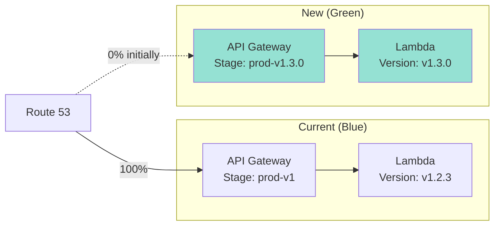
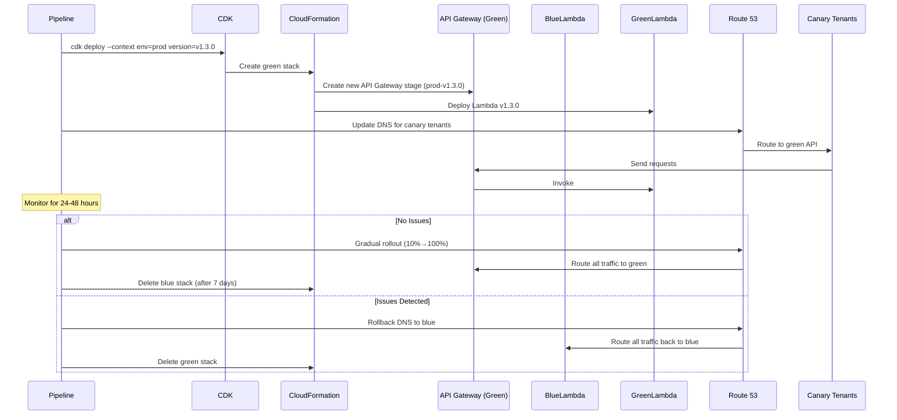

# Deployment Architecture

**Document Version:** 1.0
**Last Updated:** 2025-11-09
**Status:** Draft

---

## 1. Deployment Strategy Overview

### 1.1 Deployment Principles

1. **Zero Downtime**: All deployments must have zero user-facing downtime
2. **Automated**: No manual steps (except approvals)
3. **Gradual Rollout**: Canary deployment to detect issues early
4. **Fast Rollback**: Ability to rollback within 5 minutes
5. **Immutable Infrastructure**: Replace, don't update

### 1.2 Deployment Model

**Blue-Green Deployment with Canary Rollout**



**Rollout Phases**:
1. Deploy green environment (new version)
2. Route 1-2 canary tenants to green (via subdomain DNS)
3. Monitor for 24-48 hours
4. Gradual rollout: 10% → 25% → 50% → 100% of tenants
5. Decommission blue environment after 7 days

---

## 2. Environment Strategy

### 2.1 Environments

| Environment | AWS Account | Purpose | Deployment Trigger | Data |
|-------------|-------------|---------|-------------------|------|
| **Dev** | 123456789012 (dev) | Rapid iteration, feature testing | Auto-deploy on commit to `develop` | Synthetic test data |
| **UAT** | 234567890123 (uat) | Client acceptance testing | Manual approval from `develop` | Anonymized production data |
| **Prod** | 345678901234 (prod) | Live customer workloads | Manual approval from `main` | Real customer data |

### 2.2 Environment Configuration

**Configuration Management**: Environment variables + AWS Parameter Store

| Config | Dev | UAT | Prod |
|--------|-----|-----|------|
| **API Domain** | api-dev.viewdocs.example.com | api-uat.viewdocs.example.com | api.viewdocs.example.com |
| **Frontend Domain** | dev.viewdocs.example.com | uat.viewdocs.example.com | viewdocs.example.com |
| **DynamoDB Table** | viewdocs-data-dev | viewdocs-data-uat | viewdocs-data-prod |
| **Log Level** | DEBUG | INFO | WARN |
| **Audit Retention** | 1 week (TTL) | 1 month (TTL) | 6 months (TTL) |
| **Lambda Concurrency** | 10 | 50 | 100 |
| **DynamoDB Capacity** | On-demand | Provisioned (50 RCU/WCU) | Provisioned (100 RCU/WCU) with auto-scaling |

**CDK Context** (`cdk.context.json`):
```json
{
  "dev": {
    "account": "123456789012",
    "region": "ap-southeast-2",
    "domain": "dev.viewdocs.example.com",
    "logLevel": "DEBUG"
  },
  "uat": {
    "account": "234567890123",
    "region": "ap-southeast-2",
    "domain": "uat.viewdocs.example.com",
    "logLevel": "INFO"
  },
  "prod": {
    "account": "345678901234",
    "region": "ap-southeast-2",
    "domain": "viewdocs.example.com",
    "logLevel": "WARN"
  }
}
```

---

## 3. CI/CD Pipeline

### 3.1 Pipeline Architecture

```mermaid
graph LR
    Source[CodeCommit/GitHub<br/>develop branch] --> Build[Build Stage]
    Build --> Test[Test Stage]
    Test --> DevDeploy[Deploy Dev]
    DevDeploy --> IntegrationTest[Integration Tests]
    IntegrationTest --> ManualApproval1[Manual Approval<br/>Tech Lead]
    ManualApproval1 --> UATDeploy[Deploy UAT]
    UATDeploy --> E2ETest[E2E Tests]
    E2ETest --> LoadTest[Load Tests]
    LoadTest --> ManualApproval2[Manual Approval<br/>Product Owner]
    ManualApproval2 --> ProdDeploy[Deploy Prod<br/>Blue-Green]
    ProdDeploy --> CanaryMonitor[Monitor Canary<br/>24-48 hours]
    CanaryMonitor --> GradualRollout[Gradual Rollout<br/>10%→100%]

    style ProdDeploy fill:#FF6B6B
    style ManualApproval1 fill:#FFD93D
    style ManualApproval2 fill:#FFD93D
```



### 3.2 Pipeline Stages

#### Stage 1: Source

**Trigger**: Git commit to `develop` or `main` branch

**Source Control**:
- **Primary**: AWS CodeCommit (within AWS)
- **Alternative**: GitHub (with GitHub Actions integration)

**Branching Strategy**: GitFlow
- `main` → Production
- `develop` → Dev environment
- `feature/*` → Local development
- `release/*` → UAT environment
- `hotfix/*` → Fast-track to production

#### Stage 2: Build

**Tools**: npm, esbuild, TypeScript compiler

**Steps**:
1. Install dependencies: `npm ci` (faster than `npm install`, uses package-lock.json)
2. Lint code: `npm run lint`
3. Compile TypeScript: `tsc --noEmit` (type checking)
4. Bundle Lambda functions: `esbuild` (tree-shaking, minification)
5. Build Angular frontend: `ng build --configuration=production`
6. Synth CDK: `cdk synth` (generate CloudFormation templates)

**Artifacts**:
- Lambda function bundles (.zip files)
- Frontend dist/ folder
- CloudFormation templates (JSON)

**Build Time**: ~5 minutes

#### Stage 3: Test

**Unit Tests**:
```bash
npm test -- --coverage --ci
```

**Coverage Threshold**: 80% (branches, functions, lines, statements)

**Test Reports**: JUnit XML format, published to CodeBuild

**Failed Tests**: Pipeline stops, sends SNS notification to team

#### Stage 4: Deploy Dev

**Tool**: AWS CDK Pipelines (self-mutating)

**Steps**:
1. Bootstrap CDK (if first deployment): `cdk bootstrap`
2. Deploy all stacks: `cdk deploy --all --context env=dev --require-approval never`
3. Update Lambda function code (if stack already exists)
4. Wait for stack completion (CloudFormation polls)

**Deployment Time**: ~10 minutes (first deployment), ~3 minutes (updates)

#### Stage 5: Integration Tests

**Framework**: Jest + axios

**Tests**:
- Health check: `GET /health` returns 200
- Authentication: Login with test user, verify JWT token
- Document view: Fetch document, verify response
- ACL enforcement: Attempt unauthorized access, verify 403

**Test Execution**:
```bash
cd integration-tests
npm test -- --env=dev
```

**Failure Handling**: Pipeline stops, rollback dev deployment

#### Stage 6: Manual Approval (Tech Lead)

**Approver**: Tech Lead or Senior Developer

**Criteria**:
- All unit tests passing
- All integration tests passing
- No critical security vulnerabilities (Snyk scan)
- Code review completed

**Notification**: SNS email to tech lead

**Approval Timeout**: 24 hours (auto-reject if not approved)

#### Stage 7: Deploy UAT

**Same as Dev Deploy**, but with `--context env=uat`

**Additional Step**: Restore anonymized production data to UAT DynamoDB

#### Stage 8: E2E Tests

**Framework**: Cypress

**Tests**:
- User login flow (SAML redirect, JWT issuance)
- Document search (index search, full-text search)
- Document view (render PDF in viewer)
- Bulk download (initiate job, check status, download zip)
- Comment workflow (add, edit, view history)
- Admin workflow (create tenant, manage users, assign ACLs)

**Test Execution**:
```bash
cd frontend
npm run e2e:uat
```

**Screenshots/Videos**: Saved to S3 for debugging

#### Stage 9: Load Tests

**Framework**: Artillery

**Scenario**:
- Ramp up from 0 to 500 concurrent users over 5 minutes
- Each user performs 10 actions/minute (search, view, download)
- Duration: 15 minutes
- Total requests: ~45,000

**Metrics**:
- API latency (p50, p95, p99)
- Error rate (target: <1%)
- Lambda throttles (target: 0)
- DynamoDB throttles (target: 0)

**Artillery Config** (`artillery.yml`):
```yaml
config:
  target: "https://api-uat.viewdocs.example.com"
  phases:
    - duration: 300
      arrivalRate: 10
      rampTo: 100
  processor: "./scenarios.js"
scenarios:
  - flow:
      - get:
          url: "/documents/search"
          headers:
            Authorization: "Bearer {{ token }}"
      - think: 2
      - get:
          url: "/documents/{{ docId }}/content"
```

**Pass Criteria**:
- p95 latency < 500ms
- Error rate < 1%
- No throttling

#### Stage 10: Manual Approval (Product Owner)

**Approver**: Product Owner or Business Stakeholder

**Criteria**:
- UAT testing complete
- E2E tests passing
- Load tests passing
- Release notes reviewed

**Approval Timeout**: 72 hours

#### Stage 11: Deploy Production (Blue-Green)

**Blue-Green Deployment Process**:



**Deployment Steps**:

1. **Deploy Green Environment**:
```bash
cdk deploy --all \
  --context env=prod \
  --context version=v1.3.0 \
  --require-approval never
```

2. **Create API Gateway Stage**:
   - New stage: `prod-v1.3.0`
   - Keep existing: `prod` (blue)

3. **Route Canary Tenants**:
   - Update Route 53 DNS for `canary1.viewdocs.example.com` → Green API
   - Update Route 53 DNS for `canary2.viewdocs.example.com` → Green API

4. **Monitor Canary** (24-48 hours):
   - CloudWatch dashboard: API latency, error rate, Lambda errors
   - X-Ray: Trace errors in green environment
   - DynamoDB: Check for throttling
   - User feedback: Manual testing by canary tenants

5. **Gradual Rollout**:
   - Hour 0: 10% of tenants (50 tenants)
   - Hour 6: 25% of tenants (125 tenants)
   - Hour 12: 50% of tenants (250 tenants)
   - Hour 24: 100% of tenants (500 tenants)

6. **Rollback Procedure** (if issues detected):
   - Revert Route 53 DNS to blue API (< 5 minutes)
   - Delete green stack: `cdk destroy --context version=v1.3.0`

7. **Decommission Blue** (after 7 days):
   - Delete old API Gateway stage: `prod-v1.2.3`
   - Delete old Lambda versions

#### Stage 12: Post-Deployment Monitoring

**Automated Checks** (first 48 hours):
- CloudWatch alarm: Error rate > 1% → SNS alert → auto-rollback
- CloudWatch alarm: API latency p95 > 1s → SNS alert
- CloudWatch alarm: DynamoDB throttles > 0 → SNS alert

**Manual Checks**:
- Review CloudWatch Logs for errors
- Check X-Ray service map for anomalies
- Review user feedback (helpdesk tickets)

---

## 4. CDK Pipelines Configuration

### 4.1 CDK Pipeline Stack

```typescript
// lib/stacks/pipeline-stack.ts
import * as cdk from 'aws-cdk-lib';
import * as pipelines from 'aws-cdk-lib/pipelines';
import * as codecommit from 'aws-cdk-lib/aws-codecommit';

export class ViewdocsPipelineStack extends cdk.Stack {
  constructor(scope: cdk.App, id: string, props?: cdk.StackProps) {
    super(scope, id, props);

    const repo = codecommit.Repository.fromRepositoryName(
      this,
      'Repo',
      'viewdocs'
    );

    const pipeline = new pipelines.CodePipeline(this, 'Pipeline', {
      pipelineName: 'ViewdocsDeploymentPipeline',
      synth: new pipelines.ShellStep('Synth', {
        input: pipelines.CodePipelineSource.codeCommit(repo, 'develop'),
        commands: [
          'npm ci',
          'npm run build',
          'npm run test',
          'npx cdk synth'
        ]
      })
    });

    // Dev stage
    const devStage = new ViewdocsApplicationStage(this, 'Dev', {
      env: { account: '123456789012', region: 'ap-southeast-2' },
      envName: 'dev'
    });
    pipeline.addStage(devStage, {
      post: [
        new pipelines.ShellStep('IntegrationTests', {
          envFromCfnOutputs: {
            API_ENDPOINT: devStage.apiEndpoint
          },
          commands: ['npm run test:integration']
        })
      ]
    });

    // UAT stage (with manual approval)
    const uatStage = new ViewdocsApplicationStage(this, 'UAT', {
      env: { account: '234567890123', region: 'ap-southeast-2' },
      envName: 'uat'
    });
    pipeline.addStage(uatStage, {
      pre: [new pipelines.ManualApprovalStep('ApproveUAT')],
      post: [
        new pipelines.ShellStep('E2ETests', {
          commands: ['npm run e2e:uat']
        }),
        new pipelines.ShellStep('LoadTests', {
          commands: ['npm run load-test:uat']
        })
      ]
    });

    // Prod stage (with manual approval)
    const prodStage = new ViewdocsApplicationStage(this, 'Prod', {
      env: { account: '345678901234', region: 'ap-southeast-2' },
      envName: 'prod'
    });
    pipeline.addStage(prodStage, {
      pre: [new pipelines.ManualApprovalStep('ApproveProd')]
    });
  }
}
```

### 4.2 Application Stage

```typescript
// lib/application-stage.ts
import * as cdk from 'aws-cdk-lib';
import { DataStack } from './stacks/data-stack';
import { ApiStack } from './stacks/api-stack';
import { FrontendStack } from './stacks/frontend-stack';

export class ViewdocsApplicationStage extends cdk.Stage {
  public readonly apiEndpoint: cdk.CfnOutput;

  constructor(scope: cdk.App, id: string, props: StageProps) {
    super(scope, id, props);

    const dataStack = new DataStack(this, 'Data', { envName: props.envName });
    const apiStack = new ApiStack(this, 'Api', {
      envName: props.envName,
      table: dataStack.table
    });
    const frontendStack = new FrontendStack(this, 'Frontend', {
      envName: props.envName,
      apiUrl: apiStack.apiUrl
    });

    this.apiEndpoint = apiStack.apiEndpoint;
  }
}
```

---

## 5. Rollback Procedures

### 5.1 Automated Rollback

**Trigger**: CloudWatch alarm for error rate > 5%

**Alarm Configuration**:
```typescript
const errorAlarm = new cloudwatch.Alarm(this, 'HighErrorRate', {
  metric: apiGateway.metricServerError(),
  threshold: 5,
  evaluationPeriods: 2,
  datapointsToAlarm: 2,
  alarmDescription: 'API error rate exceeds 5%',
  actionsEnabled: true
});

errorAlarm.addAlarmAction(new cloudwatchActions.SnsAction(rollbackTopic));
```

**Rollback Lambda**:
```typescript
export async function rollbackHandler(event: SNSEvent) {
  const alarmData = JSON.parse(event.Records[0].Sns.Message);

  // 1. Get current blue and green API stages
  const stages = await apiGateway.getStages({ restApiId }).promise();
  const greenStage = stages.item.find(s => s.stageName.includes('green'));
  const blueStage = stages.item.find(s => s.stageName === 'prod');

  // 2. Update Route 53 to point back to blue
  await route53.changeResourceRecordSets({
    HostedZoneId: hostedZoneId,
    ChangeBatch: {
      Changes: [{
        Action: 'UPSERT',
        ResourceRecordSet: {
          Name: 'api.viewdocs.example.com',
          Type: 'A',
          AliasTarget: {
            HostedZoneId: apiGatewayHostedZoneId,
            DNSName: blueStage.invokeUrl
          }
        }
      }]
    }
  }).promise();

  // 3. Send notification
  await sns.publish({
    TopicArn: alertTopicArn,
    Subject: 'Viewdocs Auto-Rollback Triggered',
    Message: `Rolled back from ${greenStage.stageName} to ${blueStage.stageName} due to high error rate.`
  }).promise();
}
```

### 5.2 Manual Rollback

**Scenarios**:
- User-reported issues not caught by alarms
- Data inconsistencies
- Integration failures with on-premise systems

**Procedure**:
1. Identify blue stage version (previous stable version)
2. Update Route 53 DNS to blue API
3. Verify rollback success (smoke tests)
4. Delete green stack

**CLI Commands**:
```bash
# 1. List API stages
aws apigateway get-stages --rest-api-id <api-id>

# 2. Update Route 53 (use AWS Console or CLI)
aws route53 change-resource-record-sets --hosted-zone-id <zone-id> --change-batch file://rollback.json

# 3. Delete green stack
cdk destroy ViewdocsApplicationStage-Prod-Green
```

**rollback.json**:
```json
{
  "Changes": [{
    "Action": "UPSERT",
    "ResourceRecordSet": {
      "Name": "api.viewdocs.example.com",
      "Type": "A",
      "AliasTarget": {
        "HostedZoneId": "Z1UJRXOUMOOFQ8",
        "DNSName": "d1234abcd.execute-api.ap-southeast-2.amazonaws.com"
      }
    }
  }]
}
```

---

## 6. Deployment Metrics

### 6.1 Deployment Frequency

**Target**: 2-3 deployments per week (dev), 1 deployment per 2 weeks (prod)

**Current Baseline**: TBD (track after 3 months)

### 6.2 Lead Time

**Lead Time**: Time from commit to production deployment

**Target**: < 4 hours (excluding manual approval wait time)

**Breakdown**:
- Build + Test: 10 minutes
- Deploy Dev: 10 minutes
- Integration Tests: 5 minutes
- Deploy UAT: 10 minutes
- E2E Tests: 20 minutes
- Load Tests: 20 minutes
- Deploy Prod: 15 minutes
- **Total**: ~90 minutes (automated), + manual approval wait time

### 6.3 Change Failure Rate

**Definition**: % of deployments causing production incident (rollback or hotfix)

**Target**: < 5%

**Tracking**: Count rollbacks + hotfixes / total deployments

### 6.4 Mean Time to Recovery (MTTR)

**Definition**: Time from incident detection to resolution (rollback)

**Target**: < 15 minutes (automated rollback), < 30 minutes (manual rollback)

---

## 7. Disaster Recovery Deployment

### 7.1 Multi-Region Deployment

**Primary**: ap-southeast-2 (Sydney)
**DR**: ap-southeast-4 (Melbourne)

**DR Deployment**:
- DynamoDB Global Tables (automatic replication)
- S3 Cross-Region Replication (automatic)
- Lambda functions deployed to both regions (CDK multi-region stack)
- Route 53 health checks with failover routing

**Failover Trigger**:
- Route 53 health check fails in ap-southeast-2 (3 consecutive failures)
- Automatic DNS failover to ap-southeast-4 (< 60 seconds)

**CDK Multi-Region Stack**:
```typescript
const primaryRegion = 'ap-southeast-2';
const drRegion = 'ap-southeast-4';

// Deploy to primary region
new ViewdocsApplicationStage(app, 'Prod-Primary', {
  env: { account: prodAccount, region: primaryRegion },
  envName: 'prod'
});

// Deploy to DR region
new ViewdocsApplicationStage(app, 'Prod-DR', {
  env: { account: prodAccount, region: drRegion },
  envName: 'prod-dr'
});
```

---

## Next Steps

1. Set up CodeCommit repository
2. Bootstrap CDK in all AWS accounts (dev, uat, prod)
3. Create CDK Pipeline stack
4. Configure manual approval notifications (SNS)
5. Test pipeline with feature branch deployment
6. Proceed to [07-infrastructure-architecture.md](07-infrastructure-architecture.md)

---

**Document Control**

| Version | Date | Author | Changes |
|---------|------|--------|---------|
| 1.0 | 2025-11-09 | DevOps Team, Architecture Team | Initial deployment architecture |
