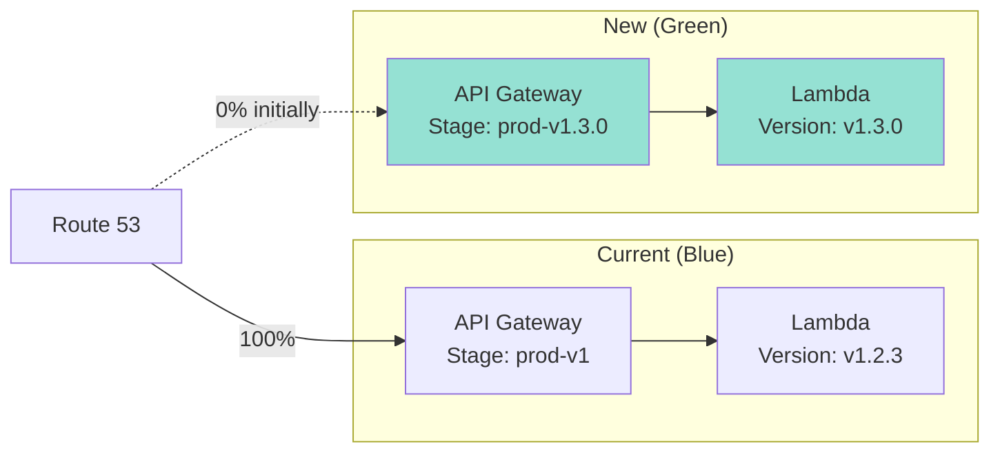
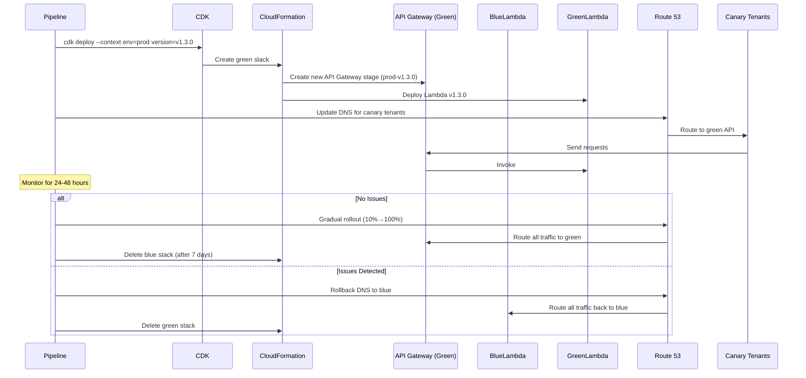

# Deployment Architecture

**Document Version:** 1.0
**Last Updated:** 2025-11-09
**Status:** Draft

---

## 1. Deployment Strategy Overview

### 1.1 Deployment Principles

1. **Zero Downtime**: All deployments must have zero user-facing downtime
2. **Automated**: No manual steps (except approvals)
3. **Gradual Rollout**: Canary deployment to detect issues early
4. **Fast Rollback**: Ability to rollback within 5 minutes
5. **Immutable Infrastructure**: Replace, don't update

### 1.2 Deployment Model

**Blue-Green Deployment with Canary Rollout**



**Rollout Phases**:
1. Deploy green environment (new version)
2. Route 1-2 canary tenants to green (via subdomain DNS)
3. Monitor for 24-48 hours
4. Gradual rollout: 10% → 25% → 50% → 100% of tenants
5. Decommission blue environment after 7 days

---

## 2. Environment Strategy

### 2.1 Environments

| Environment | AWS Account | Purpose | Deployment Trigger | Data |
|-------------|-------------|---------|-------------------|------|
| **Dev** | 123456789012 (dev) | Rapid iteration, feature testing | Auto-deploy on commit to `develop` | Synthetic test data |
| **UAT** | 234567890123 (uat) | Client acceptance testing | Manual approval from `develop` | Anonymized production data |
| **Prod** | 345678901234 (prod) | Live customer workloads | Manual approval from `main` | Real customer data |

### 2.2 Environment Configuration

**Configuration Management**: Environment variables + AWS Parameter Store

| Config | Dev | UAT | Prod |
|--------|-----|-----|------|
| **API Domain** | api-dev.viewdocs.example.com | api-uat.viewdocs.example.com | api.viewdocs.example.com |
| **Frontend Domain** | dev.viewdocs.example.com | uat.viewdocs.example.com | viewdocs.example.com |
| **DynamoDB Table** | viewdocs-data-dev | viewdocs-data-uat | viewdocs-data-prod |
| **Log Level** | DEBUG | INFO | WARN |
| **Audit Retention** | 1 week (TTL) | 1 month (TTL) | 6 months (TTL) |
| **Lambda Concurrency** | 10 | 50 | 100 |
| **DynamoDB Capacity** | On-demand | Provisioned (50 RCU/WCU) | Provisioned (100 RCU/WCU) with auto-scaling |

**CDK Context** (`cdk.context.json`):
```json
{
  "dev": {
    "account": "123456789012",
    "region": "ap-southeast-2",
    "domain": "dev.viewdocs.example.com",
    "logLevel": "DEBUG"
  },
  "uat": {
    "account": "234567890123",
    "region": "ap-southeast-2",
    "domain": "uat.viewdocs.example.com",
    "logLevel": "INFO"
  },
  "prod": {
    "account": "345678901234",
    "region": "ap-southeast-2",
    "domain": "viewdocs.example.com",
    "logLevel": "WARN"
  }
}
```

---

## 3. CI/CD Pipeline

### 3.1 Pipeline Architecture

```mermaid
graph LR
    Source[Bitbucket<br/>develop branch] --> PR[Pull Request<br/>Code Review]
    PR --> Merge[Merge to develop]
    Merge --> Jenkins[Jenkins Pipeline<br/>Triggered]
    Jenkins --> Build[Build Stage<br/>npm ci, lint, test]
    Build --> Test[Unit Tests<br/>80% coverage]
    Test --> DevDeploy[Deploy Dev<br/>CDK → CloudFormation<br/>Jenkins Agent: dev]
    DevDeploy --> IntegrationTest[Integration Tests<br/>API health checks]
    IntegrationTest --> HeatUAT[Heat Call/Change Control<br/>UAT Deployment Approval]
    HeatUAT --> UATDeploy[Deploy UAT<br/>CDK → CloudFormation<br/>Jenkins Agent: uat]
    UATDeploy --> E2ETest[E2E Tests<br/>Cypress]
    E2ETest --> LoadTest[Load Tests<br/>Artillery]
    LoadTest --> HeatProd[Heat Call/Change Control<br/>Production Deployment Approval]
    HeatProd --> ProdDeploy[Deploy Prod<br/>Blue-Green<br/>Jenkins Agent: prod]
    ProdDeploy --> CanaryMonitor[Monitor Canary<br/>24-48 hours]
    CanaryMonitor --> GradualRollout[Gradual Rollout<br/>10%→100%]

    style ProdDeploy fill:#FF6B6B
    style HeatUAT fill:#FFD93D
    style HeatProd fill:#FFD93D
```



### 3.2 Pipeline Stages

#### Stage 1: Source Control (Bitbucket)

**Trigger**: Pull Request merged to `develop` branch

**Source Control**: Bitbucket

**Branching Strategy**: GitFlow
- `main` → Production-ready code
- `develop` → Dev environment (auto-deploy on merge)
- `feature/*` → Local development, PR to develop
- `release/*` → UAT environment
- `hotfix/*` → Fast-track to production

**Pull Request Workflow**:
1. Developer creates feature branch: `feature/JIRA-123-add-bulk-download`
2. Developer creates PR to `develop` branch
3. Code review by Tech Lead (approval required)
4. PR merged to `develop`
5. Jenkins webhook triggered automatically

#### Stage 2: Jenkins Webhook Trigger

**Webhook**: Bitbucket webhook configured to trigger Jenkins job on PR merge to `develop`

**Jenkins Job**: `viewdocs-cloud-pipeline`

**Webhook Payload**:
```json
{
  "repository": {
    "name": "viewdocs-cloud"
  },
  "push": {
    "changes": [{
      "new": {
        "name": "develop",
        "type": "branch"
      }
    }]
  }
}
```

#### Stage 3: Build (Jenkins Agent: master)

**Jenkins Stage**: `Build`

**Steps**:
1. Checkout code from Bitbucket
2. Install dependencies: `npm ci`
3. Lint code: `npm run lint`
4. Compile TypeScript: `tsc --noEmit` (type checking)
5. Bundle Lambda functions: `esbuild` (tree-shaking, minification)
6. Build Angular frontend: `ng build --configuration=production`
7. Synth CDK: `cdk synth` (generate CloudFormation templates)

**Artifacts**:
- Lambda function bundles (.zip files)
- Frontend dist/ folder
- CloudFormation templates (JSON)
- Stored in Jenkins workspace for downstream stages

**Build Time**: ~5 minutes

**Jenkinsfile Example**:
```groovy
pipeline {
    agent any

    stages {
        stage('Build') {
            steps {
                sh 'npm ci'
                sh 'npm run lint'
                sh 'tsc --noEmit'
                sh 'npm run build'
                sh 'cdk synth'
            }
        }
    }
}
```

#### Stage 4: Unit Tests (Jenkins Agent: master)

**Jenkins Stage**: `Test`

**Unit Tests**:
```bash
npm test -- --coverage --ci
```

**Coverage Threshold**: 80% (branches, functions, lines, statements)

**Test Reports**: JUnit XML format, published to Jenkins

**Failed Tests**: Pipeline stops, sends notification to team (email/Slack)

**Jenkinsfile Example**:
```groovy
stage('Test') {
    steps {
        sh 'npm test -- --coverage --ci'
    }
    post {
        always {
            junit 'test-results/**/*.xml'
            publishHTML([
                reportDir: 'coverage',
                reportFiles: 'index.html',
                reportName: 'Coverage Report'
            ])
        }
        failure {
            emailext(
                subject: "Build Failed: ${env.JOB_NAME} - ${env.BUILD_NUMBER}",
                body: "Unit tests failed. Check Jenkins for details.",
                to: "${env.TEAM_EMAIL}"
            )
        }
    }
}
```

#### Stage 5: Deploy Dev (Jenkins Agent: dev)

**Jenkins Stage**: `Deploy Dev`

**Jenkins Agent**: Dedicated agent with AWS credentials for dev account (123456789012)

**Steps**:
1. Switch to dev Jenkins agent
2. Bootstrap CDK (if first deployment): `cdk bootstrap aws://123456789012/ap-southeast-2`
3. Deploy all stacks: `cdk deploy --all --context env=dev --require-approval never`
4. CloudFormation creates/updates stacks
5. Wait for stack completion (CloudFormation polls)

**Deployment Time**: ~10 minutes (first deployment), ~3 minutes (updates)

**Jenkinsfile Example**:
```groovy
stage('Deploy Dev') {
    agent { label 'jenkins-dev-agent' }
    steps {
        withAWS(credentials: 'aws-dev-credentials', region: 'ap-southeast-2') {
            sh 'cdk deploy --all --context env=dev --require-approval never'
        }
    }
    post {
        success {
            echo "Dev deployment successful"
        }
        failure {
            emailext(
                subject: "Dev Deployment Failed: ${env.JOB_NAME}",
                body: "Dev deployment failed. Check CloudFormation console.",
                to: "${env.TEAM_EMAIL}"
            )
        }
    }
}
```

#### Stage 6: Integration Tests (Jenkins Agent: master)

**Jenkins Stage**: `Integration Tests - Dev`

**Framework**: Jest + axios

**Tests**:
- Health check: `GET /health` returns 200
- Authentication: Login with test user, verify JWT token
- Document view: Fetch document, verify response
- ACL enforcement: Attempt unauthorized access, verify 403

**Test Execution**:
```bash
cd integration-tests
npm test -- --env=dev
```

**Failure Handling**: Pipeline stops, sends alert (no automatic rollback)

**Jenkinsfile Example**:
```groovy
stage('Integration Tests - Dev') {
    steps {
        sh 'cd integration-tests && npm test -- --env=dev'
    }
    post {
        failure {
            emailext(
                subject: "Integration Tests Failed: ${env.JOB_NAME}",
                body: "Dev integration tests failed. Manual investigation required.",
                to: "${env.TEAM_EMAIL}"
            )
        }
    }
}
```

#### Stage 7: Heat Call/Change Control - UAT Approval

**Approval System**: Heat System (Change Control)

**Process**:
1. Jenkins pipeline pauses at UAT deployment stage
2. Automated Heat Call/Change request is raised (via API or manual)
3. Change request includes:
   - Deployment details (version, components, impact)
   - Test results (unit, integration)
   - Rollback plan
   - Deployment window
4. Change Advisory Board (CAB) reviews request
5. Approval/rejection recorded in Heat System

**Approvers**:
- Tech Lead
- UAT Environment Owner
- Change Manager (for production-impacting changes)

**Criteria**:
- All unit tests passing ✅
- All integration tests passing ✅
- No critical security vulnerabilities (Snyk scan) ✅
- Code review completed ✅
- Deployment plan reviewed ✅

**Approval Timeout**: 24-48 hours (business days)

**Jenkins Integration**:
```groovy
stage('UAT Approval - Heat System') {
    steps {
        script {
            // Option 1: Manual input (Jenkins built-in)
            input(
                message: 'Heat Call approved for UAT deployment?',
                ok: 'Deploy to UAT',
                submitter: 'tech-lead,change-manager'
            )

            // Option 2: Heat System API integration (if available)
            // def changeId = sh(script: 'curl -X POST https://heat.example.com/api/changes ...', returnStdout: true).trim()
            // waitForApproval(changeId)
        }
    }
}
```

#### Stage 8: Deploy UAT (Jenkins Agent: uat)

**Jenkins Stage**: `Deploy UAT`

**Jenkins Agent**: Dedicated agent with AWS credentials for UAT account (234567890123)

**Steps**:
1. Switch to UAT Jenkins agent
2. Bootstrap CDK (if first deployment): `cdk bootstrap aws://234567890123/ap-southeast-2`
3. Deploy all stacks: `cdk deploy --all --context env=uat --require-approval never`
4. CloudFormation creates/updates stacks
5. Restore anonymized production data to UAT DynamoDB (optional)
6. Wait for stack completion

**Deployment Time**: ~10 minutes

**Jenkinsfile Example**:
```groovy
stage('Deploy UAT') {
    agent { label 'jenkins-uat-agent' }
    steps {
        withAWS(credentials: 'aws-uat-credentials', region: 'ap-southeast-2') {
            sh 'cdk deploy --all --context env=uat --require-approval never'
        }
    }
    post {
        success {
            echo "UAT deployment successful"
            emailext(
                subject: "UAT Deployment Success: ${env.JOB_NAME}",
                body: "UAT environment ready for testing.",
                to: "${env.QA_TEAM_EMAIL}"
            )
        }
        failure {
            emailext(
                subject: "UAT Deployment Failed: ${env.JOB_NAME}",
                body: "UAT deployment failed. Check CloudFormation console.",
                to: "${env.TEAM_EMAIL}"
            )
        }
    }
}
```

#### Stage 9: E2E Tests (Jenkins Agent: master)

**Jenkins Stage**: `E2E Tests - UAT`

**Framework**: Cypress

**Tests**:
- User login flow (SAML redirect, JWT issuance)
- Document search (index search, full-text search)
- Document view (render PDF in viewer)
- Bulk download (initiate job, check status, download zip)
- Comment workflow (add, edit, view history)
- Admin workflow (create tenant, manage users, assign ACLs)

**Test Execution**:
```bash
cd frontend
npm run e2e:uat
```

**Screenshots/Videos**: Saved to Jenkins workspace for debugging

**Jenkinsfile Example**:
```groovy
stage('E2E Tests - UAT') {
    steps {
        sh 'cd frontend && npm run e2e:uat'
    }
    post {
        always {
            archiveArtifacts artifacts: 'frontend/cypress/screenshots/**/*.png', allowEmptyArchive: true
            archiveArtifacts artifacts: 'frontend/cypress/videos/**/*.mp4', allowEmptyArchive: true
        }
        failure {
            emailext(
                subject: "E2E Tests Failed: ${env.JOB_NAME}",
                body: "UAT E2E tests failed. Check Jenkins artifacts for screenshots/videos.",
                to: "${env.QA_TEAM_EMAIL}"
            )
        }
    }
}
```

#### Stage 10: Load Tests (Jenkins Agent: master)

**Jenkins Stage**: `Load Tests - UAT`

**Framework**: Artillery

**Scenario**:
- Ramp up from 0 to 500 concurrent users over 5 minutes
- Each user performs 10 actions/minute (search, view, download)
- Duration: 15 minutes
- Total requests: ~45,000

**Metrics**:
- API latency (p50, p95, p99)
- Error rate (target: <1%)
- Lambda throttles (target: 0)
- DynamoDB throttles (target: 0)

**Artillery Config** (`artillery.yml`):
```yaml
config:
  target: "https://api-uat.viewdocs.example.com"
  phases:
    - duration: 300
      arrivalRate: 10
      rampTo: 100
  processor: "./scenarios.js"
scenarios:
  - flow:
      - get:
          url: "/documents/search"
          headers:
            Authorization: "Bearer {{ token }}"
      - think: 2
      - get:
          url: "/documents/{{ docId }}/content"
```

**Pass Criteria**:
- p95 latency < 500ms
- Error rate < 1%
- No throttling

**Jenkinsfile Example**:
```groovy
stage('Load Tests - UAT') {
    steps {
        sh 'artillery run artillery.yml --output report.json'
        sh 'artillery report report.json --output report.html'
    }
    post {
        always {
            publishHTML([
                reportDir: '.',
                reportFiles: 'report.html',
                reportName: 'Load Test Report'
            ])
        }
        failure {
            emailext(
                subject: "Load Tests Failed: ${env.JOB_NAME}",
                body: "UAT load tests failed. Check Jenkins for Artillery report.",
                to: "${env.TEAM_EMAIL}"
            )
        }
    }
}
```

#### Stage 11: Heat Call/Change Control - Production Approval

**Approval System**: Heat System (Change Control)

**Process**:
1. Jenkins pipeline pauses at production deployment stage
2. Heat Call/Change request is raised (Change Advisory Board review)
3. Change request includes:
   - Production deployment plan
   - UAT test results (E2E, load tests)
   - Risk assessment and mitigation
   - Rollback plan and timeline
   - Deployment window (typically off-peak hours)
   - Stakeholder sign-offs
4. Change Advisory Board (CAB) reviews request (may require meeting)
5. Approval/rejection recorded in Heat System

**Approvers**:
- Product Owner
- Tech Lead
- Change Manager
- Infrastructure Manager
- Security Team (for security-related changes)

**Criteria**:
- UAT testing complete ✅
- E2E tests passing ✅
- Load tests passing (p95 < 500ms) ✅
- Security scan passed ✅
- Release notes reviewed ✅
- Rollback plan documented ✅
- Deployment window scheduled ✅

**Approval Timeout**: 48-72 hours (business days)

**Deployment Window**: Typically scheduled for off-peak hours (e.g., Saturday 2:00 AM - 6:00 AM AEST)

**Jenkins Integration**:
```groovy
stage('Production Approval - Heat System') {
    steps {
        script {
            // Manual approval input
            input(
                message: 'Heat Call approved for Production deployment?',
                ok: 'Deploy to Production',
                submitter: 'product-owner,change-manager,tech-lead',
                parameters: [
                    string(name: 'HEAT_TICKET_ID', description: 'Heat Change Control Ticket ID')
                ]
            )

            echo "Production deployment approved via Heat Ticket: ${HEAT_TICKET_ID}"
        }
    }
}
```

#### Stage 12: Deploy Production (Blue-Green) (Jenkins Agent: prod)

**Blue-Green Deployment Process**:



**Jenkins Agent**: Dedicated agent with AWS credentials for production account (345678901234)

**Deployment Steps**:

1. **Deploy Green Environment**:
```bash
cdk deploy --all \
  --context env=prod \
  --context version=v1.3.0 \
  --require-approval never
```

2. **Create API Gateway Stage**:
   - New stage: `prod-v1.3.0`
   - Keep existing: `prod` (blue)

3. **Route Canary Tenants**:
   - Update Route 53 DNS for `canary1.viewdocs.example.com` → Green API
   - Update Route 53 DNS for `canary2.viewdocs.example.com` → Green API

4. **Monitor Canary** (24-48 hours):
   - CloudWatch dashboard: API latency, error rate, Lambda errors
   - X-Ray: Trace errors in green environment
   - DynamoDB: Check for throttling
   - User feedback: Manual testing by canary tenants

5. **Gradual Rollout** (Manual or automated via Jenkins job):
   - Hour 0: 10% of tenants (50 tenants)
   - Hour 6: 25% of tenants (125 tenants)
   - Hour 12: 50% of tenants (250 tenants)
   - Hour 24: 100% of tenants (500 tenants)

6. **Rollback Procedure** (if issues detected):
   - Revert Route 53 DNS to blue API (< 5 minutes)
   - Delete green stack: `cdk destroy --context version=v1.3.0`

7. **Decommission Blue** (after 7 days):
   - Delete old API Gateway stage: `prod-v1.2.3`
   - Delete old Lambda versions

**Jenkinsfile Example**:
```groovy
stage('Deploy Production - Blue-Green') {
    agent { label 'jenkins-prod-agent' }
    steps {
        withAWS(credentials: 'aws-prod-credentials', region: 'ap-southeast-2') {
            script {
                def version = env.BUILD_NUMBER

                // Deploy green environment
                sh """
                    cdk deploy --all \
                      --context env=prod \
                      --context version=${version} \
                      --require-approval never
                """

                // Route canary tenants (custom script or manual)
                echo "Route canary tenants to green environment manually or via automation script"

                // Send notification
                emailext(
                    subject: "Production Deployment Complete (Green): ${env.JOB_NAME} - v${version}",
                    body: """
                        Production green environment deployed successfully.

                        Version: ${version}
                        Environment: Green (canary)

                        Next Steps:
                        1. Monitor canary tenants for 24-48 hours
                        2. Gradual rollout (10% → 100%)
                        3. Decommission blue after 7 days

                        CloudWatch Dashboard: https://console.aws.amazon.com/cloudwatch/...
                    """,
                    to: "${env.TEAM_EMAIL},${env.PRODUCT_OWNER_EMAIL}"
                )
            }
        }
    }
    post {
        failure {
            emailext(
                subject: "Production Deployment FAILED: ${env.JOB_NAME}",
                body: "Production deployment failed. Rollback may be required. Check CloudFormation console.",
                to: "${env.TEAM_EMAIL},${env.ONCALL_EMAIL}"
            )
        }
    }
}
```

#### Stage 13: Post-Deployment Monitoring

**Automated Checks** (first 48 hours):
- CloudWatch alarm: Error rate > 1% → SNS alert → auto-rollback
- CloudWatch alarm: API latency p95 > 1s → SNS alert
- CloudWatch alarm: DynamoDB throttles > 0 → SNS alert

**Manual Checks**:
- Review CloudWatch Logs for errors
- Check X-Ray service map for anomalies
- Review user feedback (helpdesk tickets)

---

## 4. Jenkins Pipeline Configuration

### 4.1 Complete Jenkinsfile

```groovy
// Jenkinsfile
pipeline {
    agent any

    environment {
        AWS_DEFAULT_REGION = 'ap-southeast-2'
        TEAM_EMAIL = 'viewdocs-team@example.com'
        QA_TEAM_EMAIL = 'qa-team@example.com'
        PRODUCT_OWNER_EMAIL = 'product-owner@example.com'
        ONCALL_EMAIL = 'oncall@example.com'
    }

    stages {
        stage('Build') {
            steps {
                sh 'npm ci'
                sh 'npm run lint'
                sh 'tsc --noEmit'
                sh 'npm run build'
                sh 'cdk synth'
            }
        }

        stage('Test') {
            steps {
                sh 'npm test -- --coverage --ci'
            }
            post {
                always {
                    junit 'test-results/**/*.xml'
                    publishHTML([
                        reportDir: 'coverage',
                        reportFiles: 'index.html',
                        reportName: 'Coverage Report'
                    ])
                }
            }
        }

        stage('Deploy Dev') {
            agent { label 'jenkins-dev-agent' }
            steps {
                withAWS(credentials: 'aws-dev-credentials', region: "${AWS_DEFAULT_REGION}") {
                    sh 'cdk deploy --all --context env=dev --require-approval never'
                }
            }
        }

        stage('Integration Tests - Dev') {
            steps {
                sh 'cd integration-tests && npm test -- --env=dev'
            }
        }

        stage('UAT Approval - Heat System') {
            steps {
                script {
                    input(
                        message: 'Heat Call approved for UAT deployment?',
                        ok: 'Deploy to UAT',
                        submitter: 'tech-lead,change-manager',
                        parameters: [
                            string(name: 'HEAT_TICKET_ID', description: 'Heat Change Control Ticket ID')
                        ]
                    )
                    env.HEAT_UAT_TICKET = HEAT_TICKET_ID
                }
            }
        }

        stage('Deploy UAT') {
            agent { label 'jenkins-uat-agent' }
            steps {
                withAWS(credentials: 'aws-uat-credentials', region: "${AWS_DEFAULT_REGION}") {
                    sh 'cdk deploy --all --context env=uat --require-approval never'
                }
            }
        }

        stage('E2E Tests - UAT') {
            steps {
                sh 'cd frontend && npm run e2e:uat'
            }
            post {
                always {
                    archiveArtifacts artifacts: 'frontend/cypress/screenshots/**/*.png', allowEmptyArchive: true
                    archiveArtifacts artifacts: 'frontend/cypress/videos/**/*.mp4', allowEmptyArchive: true
                }
            }
        }

        stage('Load Tests - UAT') {
            steps {
                sh 'artillery run artillery.yml --output report.json'
                sh 'artillery report report.json --output report.html'
            }
            post {
                always {
                    publishHTML([
                        reportDir: '.',
                        reportFiles: 'report.html',
                        reportName: 'Load Test Report'
                    ])
                }
            }
        }

        stage('Production Approval - Heat System') {
            steps {
                script {
                    input(
                        message: 'Heat Call approved for Production deployment?',
                        ok: 'Deploy to Production',
                        submitter: 'product-owner,change-manager,tech-lead',
                        parameters: [
                            string(name: 'HEAT_TICKET_ID', description: 'Heat Change Control Ticket ID'),
                            string(name: 'DEPLOYMENT_WINDOW', description: 'Scheduled Deployment Window (e.g., 2025-02-15 02:00-06:00 AEST)')
                        ]
                    )
                    env.HEAT_PROD_TICKET = HEAT_TICKET_ID
                    env.DEPLOYMENT_WINDOW = DEPLOYMENT_WINDOW
                }
            }
        }

        stage('Deploy Production - Blue-Green') {
            agent { label 'jenkins-prod-agent' }
            steps {
                withAWS(credentials: 'aws-prod-credentials', region: "${AWS_DEFAULT_REGION}") {
                    script {
                        def version = env.BUILD_NUMBER
                        sh """
                            cdk deploy --all \
                              --context env=prod \
                              --context version=${version} \
                              --require-approval never
                        """
                    }
                }
            }
            post {
                success {
                    emailext(
                        subject: "Production Deployment Complete (Green): ${env.JOB_NAME} - Build ${env.BUILD_NUMBER}",
                        body: """
                            Production green environment deployed successfully.

                            Version: ${env.BUILD_NUMBER}
                            Heat Ticket: ${env.HEAT_PROD_TICKET}
                            Deployment Window: ${env.DEPLOYMENT_WINDOW}

                            Next Steps:
                            1. Monitor canary tenants for 24-48 hours
                            2. Gradual rollout (10% → 100%)
                            3. Decommission blue after 7 days
                        """,
                        to: "${env.TEAM_EMAIL},${env.PRODUCT_OWNER_EMAIL}"
                    )
                }
                failure {
                    emailext(
                        subject: "Production Deployment FAILED: ${env.JOB_NAME}",
                        body: "Production deployment failed. Rollback may be required.",
                        to: "${env.TEAM_EMAIL},${env.ONCALL_EMAIL}"
                    )
                }
            }
        }
    }

    post {
        failure {
            emailext(
                subject: "Pipeline Failed: ${env.JOB_NAME} - Build ${env.BUILD_NUMBER}",
                body: "Pipeline failed at stage: ${env.STAGE_NAME}. Check Jenkins for details.",
                to: "${env.TEAM_EMAIL}"
            )
        }
    }
}
```

### 4.2 Jenkins Agent Configuration

**Dev Agent** (jenkins-dev-agent):
- AWS credentials for dev account (123456789012)
- Node.js, npm, AWS CLI, CDK CLI installed
- No VPC required (Lambda deployed without VPC per ADR-012)

**UAT Agent** (jenkins-uat-agent):
- AWS credentials for UAT account (234567890123)
- Node.js, npm, AWS CLI, CDK CLI installed
- No VPC required (Lambda deployed without VPC per ADR-012)

**Prod Agent** (jenkins-prod-agent):
- AWS credentials for production account (345678901234)
- Node.js, npm, AWS CLI, CDK CLI installed
- No VPC required (Lambda deployed without VPC per ADR-012)
- Restricted access (only authorized personnel)

**Master Agent**:
- Runs build, test, integration test, E2E test, load test stages
- No AWS credentials (security best practice)

---

## 5. Rollback Procedures

### 5.1 Automated Rollback

**Trigger**: CloudWatch alarm for error rate > 5%

**Alarm Configuration**:
```typescript
const errorAlarm = new cloudwatch.Alarm(this, 'HighErrorRate', {
  metric: apiGateway.metricServerError(),
  threshold: 5,
  evaluationPeriods: 2,
  datapointsToAlarm: 2,
  alarmDescription: 'API error rate exceeds 5%',
  actionsEnabled: true
});

errorAlarm.addAlarmAction(new cloudwatchActions.SnsAction(rollbackTopic));
```

**Rollback Lambda**:
```typescript
export async function rollbackHandler(event: SNSEvent) {
  const alarmData = JSON.parse(event.Records[0].Sns.Message);

  // 1. Get current blue and green API stages
  const stages = await apiGateway.getStages({ restApiId }).promise();
  const greenStage = stages.item.find(s => s.stageName.includes('green'));
  const blueStage = stages.item.find(s => s.stageName === 'prod');

  // 2. Update Route 53 to point back to blue
  await route53.changeResourceRecordSets({
    HostedZoneId: hostedZoneId,
    ChangeBatch: {
      Changes: [{
        Action: 'UPSERT',
        ResourceRecordSet: {
          Name: 'api.viewdocs.example.com',
          Type: 'A',
          AliasTarget: {
            HostedZoneId: apiGatewayHostedZoneId,
            DNSName: blueStage.invokeUrl
          }
        }
      }]
    }
  }).promise();

  // 3. Send notification
  await sns.publish({
    TopicArn: alertTopicArn,
    Subject: 'Viewdocs Auto-Rollback Triggered',
    Message: `Rolled back from ${greenStage.stageName} to ${blueStage.stageName} due to high error rate.`
  }).promise();
}
```

### 5.2 Manual Rollback

**Scenarios**:
- User-reported issues not caught by alarms
- Data inconsistencies
- Integration failures with on-premise systems

**Procedure**:
1. Identify blue stage version (previous stable version)
2. Update Route 53 DNS to blue API
3. Verify rollback success (smoke tests)
4. Delete green stack

**CLI Commands**:
```bash
# 1. List API stages
aws apigateway get-stages --rest-api-id <api-id>

# 2. Update Route 53 (use AWS Console or CLI)
aws route53 change-resource-record-sets --hosted-zone-id <zone-id> --change-batch file://rollback.json

# 3. Delete green stack
cdk destroy ViewdocsApplicationStage-Prod-Green
```

**rollback.json**:
```json
{
  "Changes": [{
    "Action": "UPSERT",
    "ResourceRecordSet": {
      "Name": "api.viewdocs.example.com",
      "Type": "A",
      "AliasTarget": {
        "HostedZoneId": "Z1UJRXOUMOOFQ8",
        "DNSName": "d1234abcd.execute-api.ap-southeast-2.amazonaws.com"
      }
    }
  }]
}
```

---

## 6. Deployment Metrics

### 6.1 Deployment Frequency

**Target**: 2-3 deployments per week (dev), 1 deployment per 2 weeks (prod)

**Current Baseline**: TBD (track after 3 months)

### 6.2 Lead Time

**Lead Time**: Time from commit to production deployment

**Target**: < 4 hours (excluding manual approval wait time)

**Breakdown**:
- Build + Test: 10 minutes
- Deploy Dev: 10 minutes
- Integration Tests: 5 minutes
- Deploy UAT: 10 minutes
- E2E Tests: 20 minutes
- Load Tests: 20 minutes
- Deploy Prod: 15 minutes
- **Total**: ~90 minutes (automated), + manual approval wait time

### 6.3 Change Failure Rate

**Definition**: % of deployments causing production incident (rollback or hotfix)

**Target**: < 5%

**Tracking**: Count rollbacks + hotfixes / total deployments

### 6.4 Mean Time to Recovery (MTTR)

**Definition**: Time from incident detection to resolution (rollback)

**Target**: < 15 minutes (automated rollback), < 30 minutes (manual rollback)

---

## 7. Disaster Recovery Deployment

### 7.1 Multi-Region Deployment

**Primary**: ap-southeast-2 (Sydney)
**DR**: ap-southeast-4 (Melbourne)

**DR Deployment**:
- DynamoDB Global Tables (automatic replication)
- S3 Cross-Region Replication (automatic)
- Lambda functions deployed to both regions (CDK multi-region stack)
- Route 53 health checks with failover routing

**Failover Trigger**:
- Route 53 health check fails in ap-southeast-2 (3 consecutive failures)
- Automatic DNS failover to ap-southeast-4 (< 60 seconds)

**CDK Multi-Region Stack**:
```typescript
const primaryRegion = 'ap-southeast-2';
const drRegion = 'ap-southeast-4';

// Deploy to primary region
new ViewdocsApplicationStage(app, 'Prod-Primary', {
  env: { account: prodAccount, region: primaryRegion },
  envName: 'prod'
});

// Deploy to DR region
new ViewdocsApplicationStage(app, 'Prod-DR', {
  env: { account: prodAccount, region: drRegion },
  envName: 'prod-dr'
});
```

---

## Next Steps

1. Configure Bitbucket webhook to trigger Jenkins on PR merge to `develop`
2. Set up Jenkins agents for dev, uat, and prod environments
3. Configure AWS credentials in Jenkins for each environment
4. Bootstrap CDK in all AWS accounts (dev, uat, prod)
5. Create Jenkinsfile in repository root
6. Configure Heat System integration (API or manual approval workflow)
7. Test pipeline with feature branch deployment
8. Proceed to [07-infrastructure-architecture.md](07-infrastructure-architecture.md)

---

**Document Control**

| Version | Date | Author | Changes |
|---------|------|--------|---------|
| 1.0 | 2025-11-09 | DevOps Team, Architecture Team | Initial deployment architecture |
