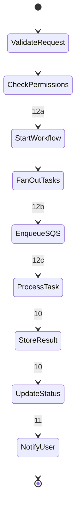

# Application Architecture Flows

This document provides a comprehensive reference for all data flows in the application architecture diagram, organized by architectural pillars.

## Table of Contents
- [Architecture Pillar Overview](#architecture-pillar-overview)
- [Flow Summary](#flow-summary)
- [Pillar 1: Presentation & User Access (1-5)](#pillar-1-presentation--user-access-1-5)
- [Pillar 2: API Gateway & Authentication (6-8)](#pillar-2-api-gateway--authentication-6-8)
- [Pillar 3: Compute Services (9)](#pillar-3-compute-services-9)
- [Pillar 4: Data & Storage (10)](#pillar-4-data--storage-10)
- [Pillar 5: External Integrations (11)](#pillar-5-external-integrations-11)
- [Pillar 6: Monitoring & Security](#pillar-6-monitoring--security)
- [Async Workflows (12a-12c)](#async-workflows-12a-12c)

---

## Architecture Pillar Overview

The architecture is organized into 6 distinct layers:

| Pillar | Purpose | Key Components | Flow Range |
|--------|---------|----------------|------------|
| **1. Presentation & User Access** | User-facing layer with security filtering | DNS, WAF, Shield, CDN, Static Assets | 1-5 |
| **2. API Gateway & Authentication** | API routing and token validation | API Gateway, Auth Service, Identity Provider | 6-8 |
| **3. Compute Services** | Business logic execution | Multiple serverless functions + orchestration | 9 |
| **4. Data & Storage** | Persistent data and state | Databases, Object Storage, Secrets, Cache | 10 |
| **5. External Integrations** | External systems and APIs | Archive Systems, Event Hub, Email, External Platform | 11 |
| **6. Monitoring & Security** | Observability and compliance | Logging, Tracing, Audit, Threat Detection, Encryption | (implicit) |

---

## Flow Summary

| Flow ID | Source | Destination | Description |
|---------|--------|-------------|-------------|
| **1** | End Users | Route 53 | DNS query |
| **2** | Route 53 | WAF | Traffic filtering |
| **3** | WAF | Shield | DDoS protection |
| **4** | Shield | CloudFront | HTTPS traffic |
| **5** | CloudFront | S3 | Serve static assets |
| **6** | CloudFront | API Gateway | API proxy |
| **7** | API Gateway | Auth Service | Token validation |
| **8** | Auth Service | Identity Provider | Authentication |
| **9** | API Gateway | Compute Services | Route to business logic |
| **10** | Compute Services | Data & Storage | Data operations |
| **11a** | Document Service | Archive Systems | Fetch documents from archives |
| **11b** | Search Service | Archive Systems | Search archive indexes |
| **11c** | Integration Wrapper | External Backend | External platform integration |
| **12a** | Download Service | Step Functions | Start workflow |
| **12b** | Step Functions | SQS Queue | Enqueue tasks |
| **12c** | SQS Queue | Document Worker | Process tasks |

---

## Pillar 1: Presentation & User Access (1-5)

**Purpose**: Secure, low-latency content delivery with DDoS protection and edge caching.

### Flow Details

| Flow ID | Source | Destination | Description | Protocol |
|---------|--------|-------------|-------------|----------|
| **1. DNS** | End Users | Route 53 | DNS resolution for subdomain | DNS |
| **2. Filter** | Route 53 | WAF | Web application firewall filtering | HTTPS |
| **3. Protect** | WAF | Shield | DDoS protection layer | Inline |
| **4. HTTPS** | Shield | CloudFront | Secure content delivery | HTTPS |
| **5. Static** | CloudFront | S3 | Serve static assets (SPA) | HTTPS |

### Flow Sequence:
```
End User → Route 53 (DNS) → WAF (Filter) → Shield (Protect) → CloudFront (CDN) → S3 (Static Assets)
```

### Key Features:
- **TLS Encryption**: All communication encrypted in transit
- **DDoS Protection**: Always-on protection at multiple layers
- **WAF Rules**: Web application firewall with custom rules
- **Edge Caching**: Global CDN with high cache hit ratio
- **Static Hosting**: Single-page application hosting

---

## Pillar 2: API Gateway & Authentication (6-8)

**Purpose**: Secure API routing with stateless token-based authentication.

### Flow Details

| Flow ID | Source | Destination | Description | Protocol |
|---------|--------|-------------|-------------|----------|
| **6. API Proxy** | CloudFront | API Gateway | Route API requests | HTTPS |
| **7. Validate** | API Gateway | Auth Service | Token validation (authorizer) | HTTPS |
| **8. Auth** | Auth Service | Identity Provider | Federated authentication | SAML/OIDC |

### Authentication Flow:
```
1. User accesses application via CloudFront (Flow 5)
2. API calls proxied to API Gateway (Flow 6)
3. API Gateway validates token with Auth Service (Flow 7)
4. Auth Service federates with Identity Provider if needed (Flow 8)
5. Token validated, user claims extracted (tenant_id, user_id, roles)
6. Request proceeds to Compute layer (Flow 9)
```

### Token Validation (Flow 7):
```typescript
// API Gateway Authorizer
1. Extract token from Authorization header: "Bearer <token>"
2. Validate token signature
3. Check token expiry
4. Extract user claims: tenant_id, user_id, roles
5. Pass claims to compute services via request context
```

### Security:
- **Token-Based Auth**: Stateless JWT/OAuth2 tokens
- **Signature Verification**: Asymmetric key validation
- **Federated Identity**: SAML 2.0 / OIDC support
- **Claims Extraction**: User context for authorization

---

## Pillar 3: Compute Services (9)

**Purpose**: Route API requests to appropriate serverless functions for business logic execution.

### Flow Details

| Flow ID | Source | Destination | Description | Type |
|---------|--------|-------------|-------------|------|
| **9** | API Gateway | Compute Services | Invoke business logic | Synchronous |

### Service Domains:

The compute layer is organized into functional domains:

#### 1. Document & Search Domain
- **Document Service**: View and download documents
- **Search Service**: Index search across archives

#### 2. Bulk Download Domain
- **Download Service**: Job management and workflow initiation
- **Document Worker**: Fetch and aggregate documents (async)

#### 3. Admin & Integration Domain
- **Comment Service**: CRUD operations for comments
- **Admin Service**: Tenant and user management
- **Auth Service**: Token refresh and session management

#### 4. Special Integration Domain
- **Integration Wrapper**: Backend-for-Frontend (BFF) pattern for external platform integration

### API Routing Pattern:
```
API Gateway (Flow 9)
├─ /api/documents/*     → Document Service
├─ /api/search          → Search Service
├─ /api/downloads/*     → Download Service
├─ /api/comments/*      → Comment Service
├─ /api/admin/*         → Admin Service
├─ /api/auth/refresh    → Auth Service
└─ /api/integration/*   → Integration Wrapper
```

### Request Context:
All compute services receive:
- `tenant_id`: Extracted from subdomain
- `user_id`: From validated token
- `roles`: User permissions from token claims
- `request_id`: For distributed tracing

---

## Pillar 4: Data & Storage (10)

**Purpose**: Persistent data storage, state management, and caching.

### Flow Details

| Flow ID | Source | Destination | Description | Type |
|---------|--------|-------------|-------------|------|
| **10** | Compute Services | Data & Storage | Data operations | SDK API |

### Data Services:

#### Primary Data Stores
- **Database (NoSQL)**: Multi-tenant data with partition key design
  - Tenant data
  - Job status tracking
  - Cache for frequently accessed data

#### Secure Storage
- **Secrets Manager**: Credentials and API keys
  - Archive credentials
  - API keys
  - Auto-rotation enabled

#### Object Storage
- **Object Storage**: File storage with lifecycle policies
  - Bulk downloads (7-day TTL)
  - Temporary files

#### Session Management
- **User Directory**: Authentication and session data
  - Active sessions
  - Token refresh management

### Data Flow Pattern:
```
Compute Service (Flow 9)
    ↓
Query/Update Data (Flow 10)
    ├─ Database: Multi-tenant data access
    ├─ Secrets: Retrieve credentials
    ├─ Object Storage: Store/retrieve files
    └─ Cache: High-speed data access
```

### Data Organization:
```typescript
// Database partition key pattern
{
  PK: "TENANT#<tenant_id>",
  SK: "ENTITY#<entity_id>",
  // ... entity data
}

// Tenant isolation enforced at data layer
const data = await database.query({
  KeyConditionExpression: 'PK = :pk',
  ExpressionAttributeValues: {
    ':pk': `TENANT#${tenantId}`
  }
});
```

### Data Security:
- **Tenant Isolation**: Partition key includes tenant identifier
- **Access Control**: Permission checks before data access
- **Encryption at Rest**: KMS-managed keys
- **Encryption in Transit**: TLS 1.2+
- **Backup & Replication**: Automated backups

---

## Pillar 5: External Integrations (11a-11c)

**Purpose**: Integration with external archive systems, event hubs, and platforms.

### Flow Details

| Flow ID | Source | Destination | Description | Protocol |
|---------|--------|-------------|-------------|----------|
| **11a** | Document Service | Archive Systems | Fetch documents from archives | HTTPS REST/SOAP |
| **11b** | Search Service | Archive Systems | Search archive indexes | HTTPS REST/SOAP |
| **11c** | Integration Wrapper | External Backend | External platform integration | HTTPS REST |

### External Systems:

#### Archive Systems
Integration from **Document Service** and **Search Service**:

- **Archive A (Cloud API)**
  - Protocol: REST API (HTTPS)
  - Hosting: Cloud-hosted
  - Use case: Primary document storage

- **Archive B (On-Premise)**
  - Protocol: SOAP API or REST
  - Hosting: On-premise datacenter
  - Connectivity: Secure tunnel/VPN

- **Archive C (On-Premise)**
  - Protocol: SOAP API or REST
  - Hosting: Legacy on-premise system
  - Connectivity: Secure tunnel/VPN

#### Event & Notification Systems

- **Event Hub**
  - Purpose: Event integration and forwarding
  - Protocol: REST/SOAP API
  - Events: Document operations, user actions

- **Email Service**
  - Purpose: Notification delivery
  - Protocol: REST API
  - Use case: Job completion, alerts

#### External Platform

- **External Backend**
  - Purpose: Independent REST API service
  - Protocol: REST API
  - Integration: Via **Integration Wrapper** (BFF pattern)

### Archive Integration Pattern:
```typescript
// Archive selection based on tenant configuration
const archiveConfig = await getArchiveConfig(tenantId);

let document;
switch (archiveConfig.type) {
  case 'ARCHIVE_A':
    // Cloud API (Flow 11)
    document = await archiveAClient.getDocument(docId);
    break;

  case 'ARCHIVE_B':
    // On-premise (Flow 11)
    document = await archiveBClient.getDocument(docId);
    break;

  case 'ARCHIVE_C':
    // Legacy system (Flow 11)
    document = await archiveCClient.getDocument(docId);
    break;
}
```

### BFF Integration Pattern (Integration Wrapper):
```
┌─────────────────┐
│ Application UI  │  (Unified UX)
└────────┬────────┘
         │ API call (Flow 9)
         ▼
┌─────────────────┐
│ Integration     │  (Backend-for-Frontend)
│ Wrapper         │
└────────┬────────┘
         │ 1. Check permissions (Flow 10)
         ├──────────────┐
         │              ▼
         │       ┌──────────┐
         │       │ Database │
         │       └──────────┘
         │
         │ 2. Inject tenant context
         │ 3. Translate request format
         ▼
┌─────────────────┐
│ External Backend│  (Independent Platform - Flow 11)
│ REST API        │
└─────────────────┘
```

### Request Translation:
```typescript
// Application format (from UI)
{
  "user_id": "user123",
  "filters": { "status": "pending" }
}

// External format (translated by wrapper)
{
  "tenant_id": "tenant1",  // Injected by wrapper
  "user_id": "user123",
  "filters": { "item_status": "PENDING" }  // Field mapping
}
```

---

## Pillar 6: Monitoring & Security

**Purpose**: Observability, threat detection, and data encryption.

### Observability Services:

- **CloudWatch (Logs + Metrics)**
  - Centralized logging
  - Custom metrics
  - Dashboards and alarms

- **X-Ray (Tracing)**
  - Distributed tracing
  - Service map visualization
  - Performance bottleneck identification

- **CloudTrail (Audit)**
  - API audit logging
  - Compliance tracking
  - Security analysis

### Security Services:

- **GuardDuty (Threat Detection)**
  - Continuous monitoring
  - Anomaly detection
  - Threat intelligence

- **KMS (Encryption)**
  - Encryption key management
  - Data-at-rest encryption
  - Automatic key rotation

- **Config (Compliance)**
  - Resource configuration tracking
  - Compliance rule evaluation
  - Drift detection

### Monitoring Flow Pattern:
```
All Compute Services
    ├─ Structured Logs → CloudWatch
    ├─ Trace Data → X-Ray
    └─ Metrics → CloudWatch Metrics

All API Calls
    └─ Audit Logs → CloudTrail

All Data Services
    └─ Encrypted with KMS Keys
```

### Structured Logging Format:
```json
{
  "timestamp": "2025-01-13T10:30:00.000Z",
  "level": "INFO",
  "service": "document-service",
  "tenant_id": "tenant1",
  "user_id": "user123",
  "request_id": "abc-123-def",
  "event": "DocumentViewed",
  "latency_ms": 450,
  "status": "success"
}
```

### X-Ray Trace Example:
```
Request (500ms total)
├─ API Gateway (5ms)
├─ Compute Service (450ms)
│  ├─ Database Query (10ms)
│  ├─ Secrets Retrieval (15ms)
│  └─ External API Call (400ms)  ← Bottleneck!
└─ Response (35ms)
```

---

## Async Workflows (12a-12c)

**Purpose**: Orchestrate long-running, multi-step processes asynchronously.

### Flow Details

| Flow ID | Source | Destination | Description | Protocol |
|---------|--------|-------------|-------------|----------|
| **12a** | Download Service | Step Functions | Start workflow orchestration | SDK API |
| **12b** | Step Functions | SQS Queue | Enqueue processing tasks | SDK API |
| **12c** | SQS Queue | Document Worker | Process tasks event-driven | Event-driven |

### Bulk Download Workflow:


### Step Functions Workflow:
```json
{
  "Comment": "Bulk Download Workflow",
  "StartAt": "ValidateRequest",
  "States": {
    "ValidateRequest": {
      "Type": "Task",
      "Resource": "arn:aws:lambda:region:account:function:validate",
      "Next": "CheckPermissions"
    },
    "CheckPermissions": {
      "Type": "Task",
      "Resource": "arn:aws:lambda:region:account:function:check-permissions",
      "Next": "FanOutTasks"
    },
    "FanOutTasks": {
      "Type": "Map",
      "ItemsPath": "$.documentIds",
      "MaxConcurrency": 10,
      "Iterator": {
        "StartAt": "EnqueueSQS",
        "States": {
          "EnqueueSQS": {
            "Type": "Task",
            "Resource": "arn:aws:states:::sqs:sendMessage",
            "End": true
          }
        }
      },
      "Next": "AggregateResults"
    },
    "AggregateResults": {
      "Type": "Task",
      "Resource": "arn:aws:lambda:region:account:function:aggregate",
      "Next": "NotifyUser"
    },
    "NotifyUser": {
      "Type": "Task",
      "Resource": "arn:aws:lambda:region:account:function:notify",
      "End": true
    }
  }
}
```

### Workflow Components:

1. **Download Service** (Flow 9 → 12a)
   - Receives bulk download request
   - Validates request parameters
   - Initiates Step Functions workflow

2. **Step Functions** (12a → 12b)
   - Orchestrates multi-step process
   - Fan-out pattern for parallel processing
   - Handles retries and error handling
   - Manages state transitions

3. **SQS Queue** (12b → 12c)
   - Decouples workflow steps
   - Buffers work items
   - FIFO queue for ordered processing
   - Dead-letter queue for failed items

4. **Document Worker** (12c)
   - Processes individual documents
   - Fetches from external systems (Flow 11)
   - Stores results to object storage (Flow 10)
   - Updates job status (Flow 10)

### Performance Characteristics:
- **Max Duration**: 15 minutes (Step Functions limit)
- **Max Concurrency**: 10 parallel workers
- **Max Items**: Configurable (e.g., 1000 documents)
- **Retry Logic**: Exponential backoff with 3 attempts
- **Error Handling**: Dead-letter queue for failed items

---

## Flow Performance Targets

| Flow Category | Target Latency (p95) | Max Throughput | Notes |
|---------------|----------------------|----------------|-------|
| Presentation (1-5) | < 200ms | 10,000 req/s | CDN cache hit ratio 90% |
| API Gateway (6-7) | < 100ms | 10,000 req/s | Token validation cached |
| Compute Services (9) | < 500ms | 1,000 req/s per service | Varies by complexity |
| Data Operations (10) | < 50ms | Varies | Database read/write speed |
| External Systems (11) | < 2s | Depends on system | Archive API latency |
| Async Workflows (12) | 5-15 min | 100 concurrent jobs | Step Functions orchestration |

---

## Error Handling

### Retry Strategy:

| Service | Retry Count | Backoff | DLQ | Notes |
|---------|-------------|---------|-----|-------|
| External APIs (11) | 3 | Exponential (2^n seconds) | N/A | Archive unavailable → 503 to user |
| Async Workflows (12) | 3 | Fixed (5 seconds) | SQS DLQ | Dead-letter queue for failed tasks |
| Compute Invocation | 2 (built-in) | Immediate | N/A | Synchronous invocations only |

### Circuit Breaker Pattern:
```typescript
// Implemented for external integrations (Flow 11)
const circuitBreaker = {
  state: 'CLOSED',  // CLOSED, OPEN, HALF_OPEN
  failureCount: 0,
  threshold: 5,     // Open circuit after 5 consecutive failures
  timeout: 60000    // Try again after 60 seconds (HALF_OPEN)
};

// Before calling external API
if (circuitBreaker.state === 'OPEN') {
  return {
    statusCode: 503,
    body: JSON.stringify({
      error: 'External service temporarily unavailable'
    })
  };
}
```

---

## Security Implementation

### Data Encryption:
- **In Transit**: TLS 1.2+ (Flows 1-11)
- **At Rest**: KMS encryption (Flow 10 - all data services)
- **Hybrid Connectivity**: Secure tunnels for on-premise systems (Flow 11)

### Authentication & Authorization:
- **User Auth**: Token-based authentication (Flows 7-8)
- **Service Auth**: IAM roles for inter-service communication
- **External Auth**: Per-tenant credentials in Secrets Manager (Flow 10)

### Audit Trail:
- **All Operations**: Logged to audit database (Flow 10) + CloudWatch
- **Retention**: Configurable TTL per environment
- **Compliance**: All API calls logged via CloudTrail

---

## Related Documentation
- **Architecture Overview**: [00-architecture-overview.md](../00-architecture-overview.md)
- **Application Architecture**: [02-application-architecture.md](../02-application-architecture.md)
- **Security Architecture**: [05-security-architecture.md](../05-security-architecture.md)
- **Draw.io Diagram**: [application-architecture.drawio](./application-architecture.drawio)

---

**Last Updated**: 2025-01-13
**Version**: 3.0 (Generic pillar-based organization with correct flow numbering)
**Maintainer**: Architecture Team
