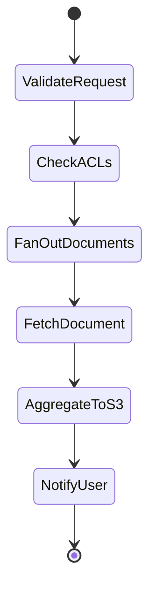

# Viewdocs Cloud - Application Architecture Flows

This document provides a comprehensive table of all data flows in the Viewdocs Cloud application architecture diagram.

## Table of Contents
- [User & Security Flows (1-9)](#user--security-flows-1-9)
- [API Gateway to Lambda Flows (10a-10g)](#api-gateway-to-lambda-flows-10a-10g)
- [Document Service Flows (11a-11f)](#document-service-flows-11a-11f)
- [Search Service Flows (12a-12b)](#search-service-flows-12a-12b)
- [Bulk Download Flows (13a-13d)](#bulk-download-flows-13a-13d)
- [Admin & Comment Flows (14a-14c)](#admin--comment-flows-14a-14c)
- [Auth Service Flows (15a-15b)](#auth-service-flows-15a-15b)
- [Event Service Flows (16a-16b)](#event-service-flows-16a-16b)
- [MailRoom Wrapper Flows (17a-17b)](#mailroom-wrapper-flows-17a-17b)
- [Monitoring Flows](#monitoring-flows)

---

## User & Security Flows (1-9)

| Flow ID | Source | Destination | Description | Protocol/Method | Notes |
|---------|--------|-------------|-------------|-----------------|-------|
| **1** | End Users | Route 53 | DNS query for tenant subdomain | DNS | Resolves `tenant1.viewdocs.example.com` to CloudFront |
| **2** | Route 53 | CloudFront | DNS resolution to CDN | DNS Response | Returns CloudFront distribution URL |
| **3** | End Users | WAF | HTTPS request | HTTPS | All traffic filtered through WAF |
| **4** | WAF | Shield | Threat filtering | Inline | Rate limiting, IP filtering, SQL injection protection |
| **5** | Shield | CloudFront | Allowed traffic | HTTPS | DDoS-protected traffic forwarded to CDN |
| **6** | CloudFront | S3 Static | Serve static assets | HTTPS | Angular SPA, images, CSS, JS files |
| **7** | CloudFront | API Gateway | Proxy API requests | HTTPS + JWT | API calls with JWT Bearer token in Authorization header |
| **8** | API Gateway | Cognito | Validate JWT token | HTTPS (Authorizer) | Cognito Lambda authorizer validates token signature & expiry |
| **9** | Cognito | API Gateway | Token validation response | HTTPS Response | Returns user claims (tenant_id, user_id, roles) if valid |

### Key Security Features:
- **TLS 1.2+**: All communication encrypted in transit
- **JWT Authentication**: Stateless token-based auth
- **DDoS Protection**: AWS Shield Standard (always on)
- **WAF Rules**: OWASP Top 10 protections

---

## API Gateway to Lambda Flows (10a-10g)

| Flow ID | Source | Destination | Description | Invocation Type | Lambda Config |
|---------|--------|-------------|-------------|-----------------|---------------|
| **10a** | API Gateway | λ Document Service | Invoke for document view/download | Sync (Request-Response) | 512MB, 29s timeout, 100 concurrency |
| **10b** | API Gateway | λ Search Service | Invoke for index search | Sync (Request-Response) | 512MB, 29s timeout, 100 concurrency |
| **10c** | API Gateway | λ Download Service | Invoke for bulk download job | Sync (Request-Response) | 256MB, 15s timeout, 50 concurrency |
| **10d** | API Gateway | λ Comment Service | Invoke for comment CRUD | Sync (Request-Response) | 256MB, 10s timeout, 50 concurrency |
| **10e** | API Gateway | λ Admin Service | Invoke for tenant/user management | Sync (Request-Response) | 512MB, 15s timeout, 10 concurrency |
| **10f** | API Gateway | λ Auth Service | Invoke for token refresh | Sync (Request-Response) | 256MB, 10s timeout, 50 concurrency |
| **10g** | API Gateway | λ MailRoom Wrapper | Invoke for MailRoom operations | Sync (Request-Response) | 512MB, 29s timeout, 50 concurrency |

### Routing Logic:
- **Path-based routing**: `/api/documents/*` → Document Service
- **Tenant isolation**: `tenant_id` extracted from subdomain in request header
- **Authorization**: User claims from Cognito JWT passed to Lambda via event context

---

## Document Service Flows (11a-11f)

| Flow ID | Source | Destination | Description | Protocol/Method | Purpose |
|---------|--------|-------------|-------------|-----------------|---------|
| **11a** | λ Document Service | DynamoDB | Query ACLs & audit logs | AWS SDK (DynamoDB API) | Check user's folder access permissions |
| **11b** | λ Document Service | IESC (REST) | Fetch document from IESC | HTTPS REST | Document stored in AWS-hosted IESC archive |
| **11c** | λ Document Service | IES (SOAP) | Fetch document from IES | SOAP/HTTPS via Direct Connect + IPsec | On-premise archive via hybrid connectivity |
| **11d** | λ Document Service | CMOD (SOAP) | Fetch document from CMOD | SOAP/HTTPS via Direct Connect + IPsec | IBM CMOD on-premise archive |
| **11e** | λ Document Service | EventBridge | Publish "DocumentViewed" event | AWS SDK (EventBridge API) | Event forwarded to HUB via FRS Proxy |
| **11f** | λ Document Service | Secrets Manager | Get archive credentials | AWS SDK (Secrets Manager API) | Retrieve per-tenant archive API credentials |

### Document Retrieval Flow:
1. User requests document via API Gateway
2. Document Service validates ACLs in DynamoDB (11a)
3. Retrieves credentials from Secrets Manager (11f)
4. Fetches document from appropriate archive (11b/11c/11d based on config)
5. Publishes audit event to EventBridge (11e)
6. Returns document binary to user via API Gateway

### ACL Check:
```typescript
// Pseudo-code
const userRoles = event.requestContext.authorizer.claims['custom:roles'];
const folderACLs = await dynamodb.get(`TENANT#${tenantId}#FOLDER#${folderId}#ACL`);
if (!folderACLs.allowedRoles.some(role => userRoles.includes(role))) {
  return { statusCode: 403, body: 'Access Denied' };
}
```

---

## Search Service Flows (12a-12b)

| Flow ID | Source | Destination | Description | Protocol/Method | Purpose |
|---------|--------|-------------|-------------|-----------------|---------|
| **12a** | λ Search Service | DynamoDB | Query ACLs | AWS SDK (DynamoDB API) | Check user's folder access permissions for search results |
| **12b** | λ Search Service | IESC (REST) | Execute index search | HTTPS REST | Search IESC index for documents matching query |

### Search Flow:
1. User submits search query via API Gateway
2. Search Service validates ACLs in DynamoDB (12a)
3. Executes search against IESC index (12b)
4. Filters results based on user's folder ACLs
5. Returns paginated search results

### Search Query Example:
```json
{
  "query": "invoice",
  "filters": {
    "date_from": "2024-01-01",
    "date_to": "2024-12-31",
    "folders": ["Finance", "Accounts"]
  },
  "page": 1,
  "page_size": 50
}
```

---

## Bulk Download Flows (13a-13d)

| Flow ID | Source | Destination | Description | Protocol/Method | Purpose |
|---------|--------|-------------|-------------|-----------------|---------|
| **13a** | λ Download Service | Step Functions | Start bulk download workflow | AWS SDK (Step Functions API) | Initiates async orchestration for up to 5GB download |
| **13b** | Step Functions | SQS Queue | Enqueue document IDs | AWS SDK (SQS API) | FIFO queue with 1 message per document, DLQ for failures |
| **13c** | SQS Queue | λ Doc Worker | Trigger document fetch | Event-driven invocation | Concurrency=1 to prevent archive API throttling |
| **13d** | λ Doc Worker | S3 Buckets | Upload zipped documents | AWS SDK (S3 API) | 72-hour lifecycle, deleted after expiry |

### Bulk Download Workflow:


### Step Functions State Machine:
1. **ValidateRequest**: Check user ACLs for all requested documents
2. **FanOutDocuments**: Map over document IDs, enqueue to SQS (13b)
3. **FetchDocument**: Lambda workers process SQS messages (13c)
4. **AggregateToS3**: Zip all documents, upload to S3 (13d)
5. **NotifyUser**: Send email via IDM Email Service with presigned S3 URL

### Performance:
- **Max duration**: 15 minutes (Step Functions limit)
- **Max file size**: 5GB (enforced at validation step)
- **Concurrency**: 1 Lambda worker per document (prevents archive throttling)

---

## Admin & Comment Flows (14a-14c)

| Flow ID | Source | Destination | Description | Protocol/Method | Purpose |
|---------|--------|-------------|-------------|-----------------|---------|
| **14a** | λ Comment Service | DynamoDB | CRUD operations on comments | AWS SDK (DynamoDB API) | Create, read, update, delete document comments |
| **14b** | λ Admin Service | DynamoDB | Manage tenants, roles, ACLs | AWS SDK (DynamoDB API) | Tenant onboarding, user role management |
| **14c** | λ Admin Service | Secrets Manager | Store archive credentials | AWS SDK (Secrets Manager API) | Per-tenant archive API keys, auto-rotation 90 days |

### Comment Data Model:
```typescript
{
  PK: "DOC#<docId>",
  SK: "COMMENT#<timestamp>#<commentId>",
  tenant_id: "tenant1",
  user_id: "user123",
  comment_text: "Please review this invoice",
  created_at: "2025-01-12T10:00:00Z"
}
```

### Tenant Onboarding (14b → 14c):
1. Admin creates tenant via Admin Service
2. Admin Service writes tenant config to DynamoDB (14b):
   - Archive type (IESC/IES/CMOD)
   - Archive endpoint URL
   - Folder structure
   - Default roles
3. Admin Service stores archive credentials in Secrets Manager (14c)
4. Admin assigns initial users and roles

---

## Auth Service Flows (15a-15b)

| Flow ID | Source | Destination | Description | Protocol/Method | Purpose |
|---------|--------|-------------|-------------|-----------------|---------|
| **15a** | λ Auth Service | Cognito | Refresh access token | AWS SDK (Cognito API) | Exchange refresh token for new access token |
| **15b** | λ Auth Service | DynamoDB | Store session metadata | AWS SDK (DynamoDB API) | Audit trail of token refreshes |

### Token Refresh Flow:
1. Frontend detects access token expiry (JWT exp claim)
2. Calls `/api/auth/refresh` with refresh token
3. Auth Service validates refresh token with Cognito (15a)
4. Cognito returns new access token + refresh token
5. Auth Service logs refresh event to DynamoDB (15b)
6. Returns new tokens to frontend

### Session Audit Schema:
```typescript
{
  PK: "TENANT#<tenantId>",
  SK: "SESSION#<userId>#<timestamp>",
  event: "TokenRefresh",
  ip_address: "203.0.113.42",
  user_agent: "Mozilla/5.0...",
  ttl: 1735689600  // 6 months from now
}
```

---

## Event Service Flows (16a-16b)

| Flow ID | Source | Destination | Description | Protocol/Method | Purpose |
|---------|--------|-------------|-------------|-----------------|---------|
| **16a** | EventBridge | λ Event Service | Event rule triggers Lambda | Event-driven invocation | Filter: `DetailType == "DocumentViewed"` |
| **16b** | λ Event Service | FRS Proxy | Forward event to HUB | SOAP/HTTPS via Direct Connect + IPsec | Integration with on-premise HUB system |

### EventBridge Rule:
```json
{
  "source": ["viewdocs"],
  "detail-type": ["DocumentViewed", "DocumentDownloaded", "SearchPerformed"],
  "detail": {
    "tenant_id": [{"exists": true}]
  }
}
```

### Event Payload Example:
```json
{
  "source": "viewdocs",
  "detail-type": "DocumentViewed",
  "detail": {
    "tenant_id": "tenant1",
    "user_id": "user123",
    "document_id": "DOC-2024-001",
    "archive": "IESC",
    "timestamp": "2025-01-12T10:30:00Z"
  }
}
```

### FRS Integration (16b):
- **Protocol**: SOAP over HTTPS
- **Authentication**: Mutual TLS (mTLS)
- **Retry**: 3 attempts with exponential backoff
- **DLQ**: Failed events sent to SQS DLQ for manual review

---

## MailRoom Wrapper Flows (17a-17b)

| Flow ID | Source | Destination | Description | Protocol/Method | Purpose |
|---------|--------|-------------|-------------|-----------------|---------|
| **17a** | λ MailRoom Wrapper | DynamoDB | Check ACLs | AWS SDK (DynamoDB API) | Validate user access before forwarding to MailRoom |
| **17b** | λ MailRoom Wrapper | MailRoom Backend | Forward API request | HTTPS REST | Backend-for-Frontend (BFF) pattern |

### MailRoom Integration Pattern (ADR-013):
```
┌─────────────────┐
│ Viewdocs UI     │  (Unified UX)
│ (Angular)       │
└────────┬────────┘
         │ API call
         ▼
┌─────────────────┐
│ MailRoom Wrapper│  (BFF + Anti-Corruption Layer)
│ Lambda          │
└────────┬────────┘
         │ 1. Check Viewdocs ACLs (17a)
         ├──────────────┐
         │              ▼
         │       ┌─────────────┐
         │       │ DynamoDB    │
         │       └─────────────┘
         │
         │ 2. Inject tenant_id
         │ 3. Translate request format
         ▼
┌─────────────────┐
│ MailRoom Backend│  (Independent Platform)
│ REST API        │
└─────────────────┘
```

### Translation Example:
```typescript
// Viewdocs format
{
  "user_id": "user123",
  "filters": { "status": "pending" }
}

// MailRoom format (translated by wrapper)
{
  "tenant_id": "tenant1",  // Injected by wrapper
  "user_id": "user123",
  "filters": { "item_status": "PENDING" }  // Field mapping
}
```

### Benefits of BFF Pattern:
- **Unified UX**: Single Viewdocs UI integrates MailRoom features
- **Isolation**: MailRoom Backend remains reusable by other clients
- **Security**: Wrapper enforces Viewdocs ACLs before forwarding
- **Flexibility**: Wrapper can translate between different API formats

---

## Monitoring Flows

| Flow ID | Source | Destination | Description | Protocol/Method | Purpose |
|---------|--------|-------------|-------------|-----------------|---------|
| **M1** | λ Document Service | CloudWatch | Log document operations | CloudWatch Logs API | Centralized logging with log groups per service |
| **M2** | λ Search Service | X-Ray | Distributed tracing | X-Ray SDK | End-to-end latency analysis, bottleneck identification |
| **M3** | DynamoDB | KMS | Encrypt data at rest | Automatic | Customer-managed KMS key, auto-rotation enabled |
| **M4** | Secrets Manager | KMS | Encrypt secrets | Automatic | Separate KMS key for secrets, 90-day rotation |

### CloudWatch Log Groups:
```
/aws/lambda/viewdocs-prod-document-service
/aws/lambda/viewdocs-prod-search-service
/aws/lambda/viewdocs-prod-download-service
...
```

### X-Ray Trace Example:
```
Request (500ms)
├─ API Gateway (5ms)
├─ Lambda Document Service (450ms)
│  ├─ DynamoDB Query ACLs (10ms)
│  ├─ Secrets Manager GetSecret (15ms)
│  └─ IESC REST API (400ms)  ← Bottleneck!
└─ CloudFront Response (45ms)
```

### CloudWatch Alarms:
| Alarm | Metric | Threshold | Action |
|-------|--------|-----------|--------|
| High Error Rate | Lambda Errors | > 5% in 2 min | SNS → PagerDuty |
| API Latency | API Gateway p95 | > 500ms | SNS → Slack |
| DynamoDB Throttles | ProvisionedThroughputExceeded | > 0 | Auto-scale DynamoDB capacity |
| Lambda Near Timeout | Duration | > 25s (29s timeout) | SNS → CloudWatch Dashboard |

### GuardDuty Integration:
- **Continuous monitoring**: Analyzes VPC Flow Logs, CloudTrail, DNS logs
- **Threat detection**: Crypto mining, credential exfiltration, unusual API activity
- **Response**: SNS → Security team for manual review

---

## Flow Summary by Category

### **User Flows**: 1-9
- DNS resolution, security filtering, authentication

### **API Invocation Flows**: 10a-10g
- API Gateway to 7 Lambda services

### **Document Operations**: 11a-11f, 12a-12b
- Document retrieval, search, ACL checks

### **Async Orchestration**: 13a-13d
- Bulk download workflow via Step Functions + SQS

### **Admin & Auth**: 14a-14c, 15a-15b
- Tenant management, token refresh

### **Event Processing**: 16a-16b
- EventBridge to HUB integration

### **MailRoom Integration**: 17a-17b
- BFF pattern with ACL enforcement

### **Observability**: M1-M4
- Logging, tracing, encryption

---

## Flow Performance Targets

| Flow Category | Target Latency (p95) | Max Throughput | Notes |
|---------------|----------------------|----------------|-------|
| Document View (11a-11f) | < 2s | 100 req/s per tenant | Dependent on archive API latency |
| Search (12a-12b) | < 1s | 50 req/s per tenant | IESC index optimized for fast queries |
| API Gateway (10a-10g) | < 500ms | 10,000 req/s (global) | API Gateway throttle limit |
| Bulk Download (13a-13d) | 5-15 min | 10 concurrent jobs per tenant | Step Functions orchestration |
| Token Refresh (15a-15b) | < 200ms | 200 req/s per tenant | Cognito SLA |
| Event Forwarding (16a-16b) | < 5s | 1,000 events/s | EventBridge + FRS Proxy |

---

## Error Handling

### Retry Strategy:
| Service | Retry Count | Backoff | DLQ | Notes |
|---------|-------------|---------|-----|-------|
| IESC/IES/CMOD API | 3 | Exponential (2^n seconds) | N/A | Archive unavailable → 503 to user |
| FRS Proxy | 3 | Exponential | SQS DLQ | Failed events stored for manual retry |
| SQS (Bulk Download) | 3 | Fixed (5 seconds) | SQS DLQ | Dead-letter queue for failed documents |
| Lambda Invocation | 2 (built-in) | Immediate | N/A | Async invocations only |

### Circuit Breaker (Archive APIs):
```typescript
// Pseudo-code
const circuitBreaker = {
  state: 'CLOSED',  // CLOSED, OPEN, HALF_OPEN
  failureCount: 0,
  threshold: 5,     // Open circuit after 5 failures
  timeout: 60000    // Try again after 60 seconds
};

if (circuitBreaker.state === 'OPEN') {
  return { statusCode: 503, body: 'Archive temporarily unavailable' };
}
```

---

## Security Flows Summary

### Data Encryption:
- **In Transit**: TLS 1.2+ (CloudFront, API Gateway, Lambda → AWS services)
- **At Rest**: KMS encryption (DynamoDB, S3, Secrets Manager)
- **Direct Connect**: IPsec VPN tunnel for on-premise connectivity

### Authentication & Authorization:
- **User Auth**: Cognito SAML 2.0 (flows 8-9)
- **Service Auth**: IAM roles for Lambda → AWS services
- **Archive Auth**: Per-tenant credentials in Secrets Manager (flow 11f)

### Audit Trail:
- **All operations**: Logged to DynamoDB audit table (flows 11a, 15b)
- **Retention**: 6 months prod, 1 month UAT, 1 week dev (TTL enabled)
- **CloudTrail**: All AWS API calls logged for compliance

---

## Related Documentation
- **Architecture Overview**: [00-architecture-overview.md](../00-architecture-overview.md)
- **Application Architecture**: [02-application-architecture.md](../02-application-architecture.md)
- **Security Architecture**: [05-security-architecture.md](../05-security-architecture.md)
- **Decision Log**: [10-decision-log.md](../10-decision-log.md)

---

**Last Updated**: 2025-01-12
**Version**: 1.0
**Maintainer**: Viewdocs Cloud Architecture Team
