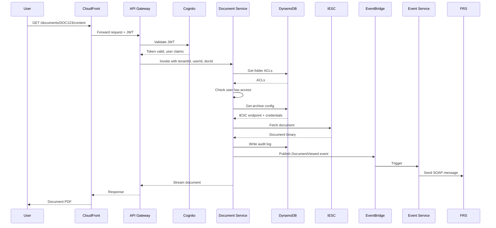
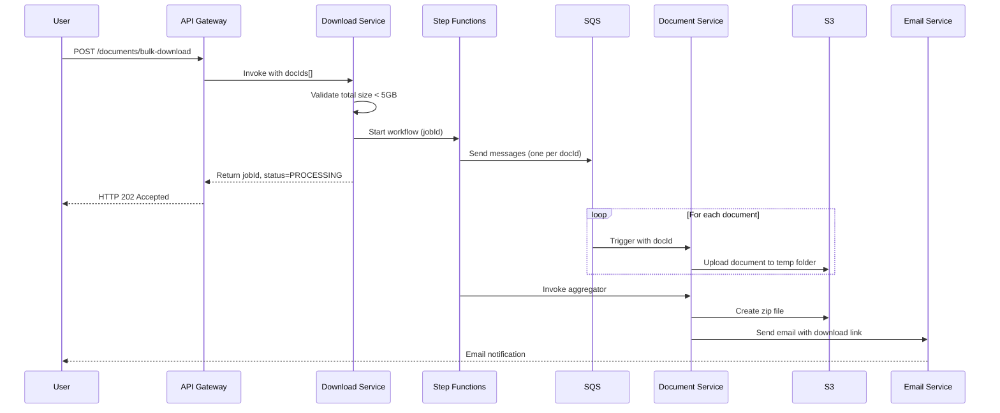

# C4 Model - Level 2: Container Diagram

**Viewdocs Cloud - Container Architecture**

This diagram zooms into the Viewdocs Cloud system to show the major containers (applications, data stores, microservices) and how they interact.

---

## Mermaid Diagram

```mermaid
C4Container
    title Container Diagram for Viewdocs Cloud

    Person(user, "User", "Client users, admins, helpdesk")

    System_Boundary(viewdocs, "Viewdocs Cloud") {
        Container(webApp, "Web Application", "Angular SPA", "Provides document management UI in user's browser")
        Container(cdn, "CloudFront CDN", "AWS CloudFront", "Distributes static assets globally, caches API responses")
        Container(apiGateway, "API Gateway", "AWS API Gateway", "Routes HTTPS requests to Lambda functions, validates JWT tokens")
        Container(cognitoAuth, "Cognito Authorizer", "AWS Cognito", "Validates JWT tokens, integrates with SAML IdPs")

        Container(docService, "Document Service", "Node.js Lambda", "Handles document view, download, fetching from archives")
        Container(searchService, "Search Service", "Node.js Lambda", "Executes searches across IESC/IES/CMOD")
        Container(downloadService, "Download Service", "Node.js Lambda", "Initiates bulk download jobs")
        Container(commentService, "Comment Service", "Node.js Lambda", "Manages document comments and history")
        Container(adminService, "Admin Service", "Node.js Lambda", "Tenant and user management")
        Container(eventService, "Event Service", "Node.js Lambda", "Publishes events to HUB via FRS")

        Container(stepFunctions, "Bulk Download Workflow", "AWS Step Functions", "Orchestrates async bulk downloads")
        Container(eventBridge, "Event Bus", "AWS EventBridge", "Centralized event routing")
        Container(sqs, "Download Queue", "AWS SQS", "Queues document fetch jobs")

        ContainerDb(dynamoDB, "Data Store", "DynamoDB Global Tables", "Stores tenant config, ACLs, audit logs, comments")
        ContainerDb(s3Downloads, "Bulk Downloads", "AWS S3", "Temporary storage for bulk download zip files")
        ContainerDb(s3Frontend, "Static Assets", "AWS S3", "Angular app build artifacts")
        ContainerDb(secrets, "Credentials Store", "AWS Secrets Manager", "Encrypted archive API credentials")
    }

    System_Ext(idp, "IDM / Customer IdP", "SAML 2.0 authentication")
    System_Ext(iesc, "IESC", "Cloud ECM (REST API)")
    System_Ext(ies, "IES", "On-prem ECM (SOAP)")
    System_Ext(cmod, "CMOD", "On-prem Archive (SOAP)")
    System_Ext(frs, "FRS Proxy", "Event forwarding (SOAP)")
    System_Ext(email, "Email Service", "IDM Email Service")

    Rel(user, cdn, "Accesses web app", "HTTPS")
    Rel(cdn, s3Frontend, "Serves static files", "HTTPS")
    Rel(cdn, apiGateway, "Proxies API calls", "HTTPS")

    Rel(user, apiGateway, "API requests", "HTTPS + JWT")
    Rel(apiGateway, cognitoAuth, "Validates token", "AWS SDK")
    Rel(cognitoAuth, idp, "Authenticates user", "SAML 2.0")

    Rel(apiGateway, docService, "Invokes", "Sync")
    Rel(apiGateway, searchService, "Invokes", "Sync")
    Rel(apiGateway, downloadService, "Invokes", "Sync")
    Rel(apiGateway, commentService, "Invokes", "Sync")
    Rel(apiGateway, adminService, "Invokes", "Sync")

    Rel(docService, dynamoDB, "Reads ACLs, writes audit logs", "AWS SDK")
    Rel(docService, secrets, "Fetches archive credentials", "AWS SDK")
    Rel(docService, iesc, "Fetches documents", "REST API")
    Rel(docService, ies, "Fetches documents", "SOAP / Direct Connect")
    Rel(docService, cmod, "Fetches documents", "SOAP / Direct Connect")
    Rel(docService, eventBridge, "Publishes events", "AWS SDK")

    Rel(searchService, dynamoDB, "Reads ACLs", "AWS SDK")
    Rel(searchService, secrets, "Fetches credentials", "AWS SDK")
    Rel(searchService, iesc, "Searches", "REST API")
    Rel(searchService, ies, "Searches", "SOAP")
    Rel(searchService, cmod, "Searches", "SOAP")

    Rel(downloadService, stepFunctions, "Starts workflow", "AWS SDK")
    Rel(stepFunctions, sqs, "Enqueues jobs", "AWS SDK")
    Rel(sqs, docService, "Triggers fetch", "Event")
    Rel(docService, s3Downloads, "Uploads documents", "AWS SDK")
    Rel(stepFunctions, email, "Sends notification", "Via Lambda")

    Rel(commentService, dynamoDB, "Reads/writes comments", "AWS SDK")
    Rel(adminService, dynamoDB, "Manages tenants, ACLs", "AWS SDK")
    Rel(adminService, secrets, "Stores credentials", "AWS SDK")

    Rel(eventBridge, eventService, "Triggers on events", "Event")
    Rel(eventService, frs, "Forwards events", "SOAP / Direct Connect")

    UpdateLayoutConfig($c4ShapeInRow="4", $c4BoundaryInRow="1")
```

---

## Container Descriptions

### Frontend Containers

| Container | Technology | Purpose | Scaling |
|-----------|------------|---------|---------|
| **Web Application** | Angular 17+ SPA | Single-page application providing UI for document search, view, download, comments, admin | Served from S3, cached by CloudFront (global edge locations) |
| **CloudFront CDN** | AWS CloudFront | Content delivery network for static assets (JS, CSS, images) and API caching | Auto-scaling (AWS-managed) |
| **Static Assets (S3)** | AWS S3 | Storage for Angular build artifacts (index.html, main.{hash}.js, styles.{hash}.css) | Durable storage, versioned |

### API Layer Containers

| Container | Technology | Purpose | Scaling |
|-----------|------------|---------|---------|
| **API Gateway** | AWS API Gateway REST API | Routes HTTPS requests to Lambda functions, enforces throttling, validates JWT via Cognito | Auto-scaling (AWS-managed), 10,000 RPS limit per account |
| **Cognito Authorizer** | AWS Cognito User Pool | Validates JWT tokens, integrates with SAML IdPs (IDM + customer IdPs), issues tokens | Auto-scaling (AWS-managed) |

### Application Service Containers (Lambda Functions)

| Container | Technology | Timeout | Memory | Concurrency | Purpose |
|-----------|------------|---------|--------|-------------|---------|
| **Document Service** | Node.js 20.x Lambda | 29s | 512MB | 100 (reserved) | Fetch documents from archives, enforce ACLs, log audit events |
| **Search Service** | Node.js 20.x Lambda | 29s | 512MB | 100 (reserved) | Execute searches across IESC/IES/CMOD, filter by user ACLs |
| **Download Service** | Node.js 20.x Lambda | 15s | 256MB | 50 | Initiate bulk download Step Functions workflows |
| **Comment Service** | Node.js 20.x Lambda | 10s | 256MB | 50 | CRUD operations for comments, version history |
| **Admin Service** | Node.js 20.x Lambda | 15s | 512MB | 10 | Tenant onboarding, user management, ACL configuration |
| **Event Service** | Node.js 20.x Lambda | 5s | 256MB | 50 | Transform events and forward to FRS Proxy |

### Orchestration Containers

| Container | Technology | Purpose | Max Duration |
|-----------|------------|---------|-------------|
| **Bulk Download Workflow** | AWS Step Functions (Standard) | Orchestrates async bulk downloads: fan-out to SQS, aggregate to zip, send email | 15 minutes |
| **Event Bus** | AWS EventBridge | Central event routing for document events (view, download, comment) | N/A (event-driven) |
| **Download Queue** | AWS SQS (FIFO) | Queues individual document fetch jobs for bulk downloads | Message retention: 4 days |

### Data Containers

| Container | Technology | Purpose | Backup/DR |
|-----------|------------|---------|-----------|
| **Data Store (DynamoDB)** | DynamoDB Global Tables | Stores tenant config, role ACLs, folder ACLs, audit logs, comments, bulk download jobs | Replicated to ap-southeast-4 (continuous replication) |
| **Bulk Downloads (S3)** | AWS S3 | Temporary storage for bulk download zip files (72-hour lifecycle) | Cross-region replication to ap-southeast-4 |
| **Static Assets (S3)** | AWS S3 | Angular app build artifacts | Versioned, cross-region replication |
| **Credentials Store** | AWS Secrets Manager | Encrypted storage for archive API credentials (IESC/IES/CMOD) | Replicated to ap-southeast-4, auto-rotation every 90 days |

---

## Inter-Container Communication

### Synchronous (Request-Response)

| From | To | Protocol | Timeout |
|------|----|----|---------|
| CloudFront | API Gateway | HTTPS | 60s |
| API Gateway | Lambda (all services) | AWS SDK (invoke) | Function timeout (5s-29s) |
| Lambda | DynamoDB | AWS SDK (query/get/put) | 5s (DynamoDB timeout) |
| Lambda | Secrets Manager | AWS SDK (getSecretValue) | 5s |
| Lambda | IESC | HTTPS (REST API) | 25s |
| Lambda | IES/CMOD | HTTPS (SOAP over Direct Connect) | 25s |
| Lambda | FRS Proxy | HTTPS (SOAP over Direct Connect) | 5s |

### Asynchronous (Event-Driven)

| From | To | Mechanism | Latency |
|------|----|----|---------|
| Document Service | EventBridge | putEvents() | <1s |
| EventBridge | Event Service | Event rule trigger | <5s |
| Download Service | Step Functions | startExecution() | <1s |
| Step Functions | SQS | sendMessage() | <1s |
| SQS | Document Service | Lambda event source mapping | <1s (poll interval) |

---

## Data Flow Examples

### Example 1: User Views Document

### Example 2: User Initiates Bulk Download

---

## Security Boundaries

### Authentication Boundary
- **Entry Point**: Cognito SAML federation
- **Enforcement**: API Gateway Cognito authorizer validates JWT on every request
- **Token Expiry**: 30 minutes (configurable)

### Authorization Boundary
- **Entry Point**: Lambda function (Document Service, Search Service)
- **Enforcement**: Query DynamoDB for folder ACLs, check user's role has permission
- **Audit**: All authorization decisions logged to DynamoDB audit table

### Network Boundary
- **Public**: CloudFront (HTTPS only, WAF enabled)
- **Private**: Lambda functions in VPC (optional, for Direct Connect to on-premise)
- **Hybrid**: Direct Connect for IES/CMOD/FRS (encrypted in transit)

---

## Scalability Considerations

| Container | Scaling Dimension | Limit | Mitigation |
|-----------|-------------------|-------|------------|
| **API Gateway** | Requests per second | 10,000 RPS (account limit) | Request limit increase, multi-region failover |
| **Lambda (Document Service)** | Concurrent executions | 100 (reserved), 1000 (account) | Reserved concurrency, request limit increase |
| **DynamoDB** | Read/Write capacity | Auto-scaling (50-500 RCU/WCU) | Increase max auto-scaling limits |
| **S3** | Requests per prefix | 5,500 GET/s per prefix | Use date-based prefixes for bulk downloads |
| **Step Functions** | Concurrent executions | 1,000,000 (no limit) | N/A |

---

## Fault Tolerance

| Failure Scenario | Impact | Recovery |
|------------------|--------|----------|
| **Lambda function failure** | Single request fails | API Gateway returns 500, client retries |
| **DynamoDB throttling** | Read/write capacity exceeded | Auto-scaling kicks in within 1 minute, Lambda retries with backoff |
| **Archive (IESC/IES/CMOD) timeout** | Document fetch fails | Lambda retries 3 times, then returns 503 to user |
| **Step Functions workflow failure** | Bulk download job fails | Email sent to user with partial results, failed documents listed |
| **EventBridge event loss** | Event not delivered to HUB | EventBridge DLQ captures failed events for manual retry |

---

## Monitoring & Observability

| Container | Metrics | Logs | Tracing |
|-----------|---------|------|---------|
| **API Gateway** | Latency (p95, p99), error rate (4xx, 5xx), request count | Access logs to CloudWatch | X-Ray (enabled) |
| **Lambda** | Duration, errors, throttles, concurrent executions | CloudWatch Logs (JSON structured) | X-Ray (enabled) |
| **DynamoDB** | ConsumedReadCapacity, ConsumedWriteCapacity, ThrottledRequests | N/A (data plane, not logged) | X-Ray (enabled) |
| **Step Functions** | Execution duration, failed executions | CloudWatch Logs (execution history) | X-Ray (enabled) |
| **S3** | GetRequests, PutRequests, 4xxErrors, 5xxErrors | S3 server access logs (disabled by default, enable for audit) | N/A |

**Centralized Dashboard**: CloudWatch dashboard with widgets for:
- API latency (p95) per endpoint
- Lambda error rate per function
- DynamoDB throttles per table
- Step Functions failed executions

---

## Cost Optimization

| Container | Cost Driver | Optimization |
|-----------|-------------|--------------|
| **Lambda** | Invocations + GB-sec | Right-size memory (512MB → 256MB if CPU-bound), use Lambda Insights to identify |
| **DynamoDB** | Provisioned capacity (RCU/WCU) | Switch to on-demand for dev/UAT, use auto-scaling for prod |
| **S3** | Storage + requests | Lifecycle policy: delete bulk downloads after 72 hours |
| **CloudFront** | Data transfer out | Enable compression, optimize cache hit ratio (longer TTLs) |
| **Secrets Manager** | Secrets stored | $0.40/secret/month, minimal cost (50 secrets = $20/month) |

---

## draw.io Reference

For creating a professional container diagram:
1. Use [draw.io](https://app.diagrams.net/)
2. Import AWS Architecture Icons (File → Open Library → AWS 19)
3. Layout:
   - **Top**: User → CloudFront → API Gateway → Cognito
   - **Middle**: Lambda functions in swim lanes
   - **Bottom**: Data stores (DynamoDB, S3, Secrets Manager)
   - **Right**: External systems (IESC, IES, CMOD, FRS)
4. Use different colors for different layers (presentation, API, services, data)
5. Export as PNG/SVG: `/docs/architecture/diagrams/container-diagram.png`

---

**Document Control**

| Version | Date | Author | Changes |
|---------|------|--------|---------|
| 1.0 | 2025-01-09 | Architecture Team | Initial C4 Level 2 container diagram |
