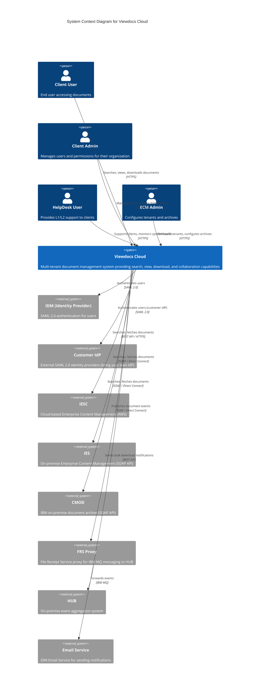
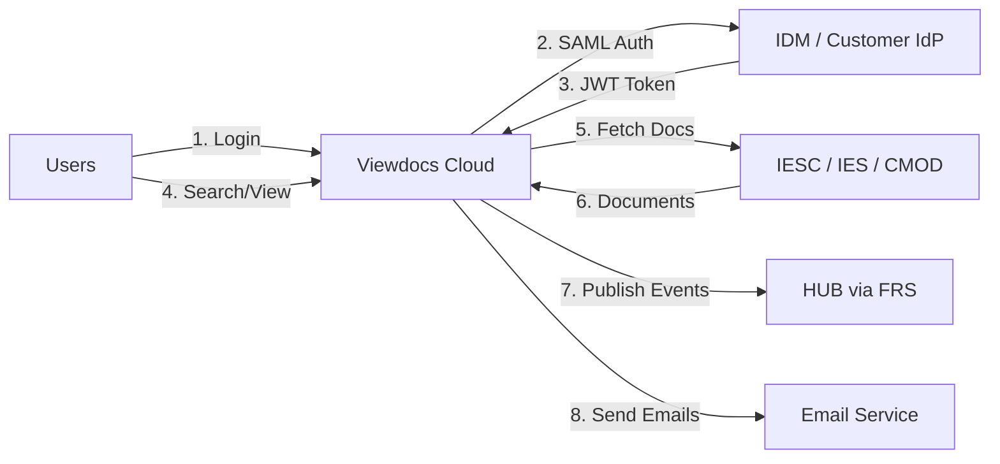

# C4 Model - Level 1: System Context Diagram

**Viewdocs Cloud - System Context**

This diagram shows how Viewdocs Cloud fits into the broader ecosystem of users and external systems.

---

## Mermaid Diagram

---

## System Responsibilities

### Viewdocs Cloud
- **Authentication**: Integrates with IDM and external SAML IdPs via AWS Cognito
- **Authorization**: Enforces role-based access control (RBAC) with folder-level ACLs
- **Document Access**: Proxies document retrieval from IESC, IES, or CMOD archives
- **Search**: Executes index-based, full-text, and conversational search across archives
- **Collaboration**: Manages document comments with version history
- **Bulk Downloads**: Orchestrates async download of up to 5GB, sends email notifications
- **Audit**: Logs all document operations for compliance (6-month retention in prod)
- **Event Publishing**: Publishes document events to HUB via FRS Proxy

---

## External Systems

| System | Type | Interface | Purpose |
|--------|------|-----------|---------|
| **IDM** | SAML 2.0 IdP | SAML | Authenticate FBDMS users and clients using IDM |
| **Customer IdP** | SAML 2.0 IdP | SAML | Authenticate users via customer's own identity provider |
| **IESC** | Cloud ECM | REST API | Store and retrieve documents in AWS-hosted archive |
| **IES** | On-Prem ECM | SOAP API | Store and retrieve documents in on-premise archive |
| **CMOD** | On-Prem Archive | SOAP API | Store and retrieve documents in IBM on-premise archive |
| **FRS Proxy** | Message Proxy | SOAP API | Forward events to HUB via IBM MQ |
| **HUB** | Event Aggregator | IBM MQ | Centralize document events from Viewdocs |
| **Email Service** | Email Platform | REST API | Send bulk download completion emails |

---

## User Personas

### Client User
- **Goal**: Find and access documents quickly and securely
- **Actions**: Search documents, view in browser, download single/bulk, add comments, send via email
- **Authorization**: Folder-level ACLs based on assigned roles

### Client Admin
- **Goal**: Manage users and control access within their organization
- **Actions**: Invite users, assign roles, configure folder ACLs
- **Authorization**: Admin role within their tenant only

### HelpDesk User
- **Goal**: Support clients and troubleshoot issues
- **Actions**: View logs, monitor system health, access documents on behalf of clients (with audit)
- **Authorization**: Cross-tenant read-only access

### ECM Admin
- **Goal**: Onboard new tenants and configure archive integrations
- **Actions**: Create tenants, configure IESC/IES/CMOD endpoints, manage branding
- **Authorization**: Full admin access across all tenants

---

## Key Interactions

### Authentication Flow
1. User navigates to `tenant.viewdocs.example.com`
2. Viewdocs redirects to AWS Cognito
3. Cognito identifies tenant from subdomain
4. Cognito redirects to appropriate IdP (IDM or customer IdP)
5. User authenticates with IdP (credentials + MFA)
6. IdP returns SAML assertion to Cognito
7. Cognito issues JWT tokens (access + refresh)
8. User accesses Viewdocs with JWT Bearer token

### Document Access Flow
1. User searches for documents (Viewdocs → IESC/IES/CMOD)
2. User clicks document to view
3. Viewdocs checks folder ACLs in DynamoDB
4. If authorized, Viewdocs fetches document from archive
5. Viewdocs streams document to user's browser
6. Viewdocs logs view event to DynamoDB
7. Viewdocs publishes event to EventBridge → FRS → HUB

### Bulk Download Flow
1. User selects multiple documents, clicks "Bulk Download"
2. Viewdocs initiates Step Functions workflow
3. Step Functions fetches documents from archive (one Lambda per document)
4. Documents aggregated into zip file in S3
5. Viewdocs sends email notification with download link
6. User downloads zip from S3 via CloudFront

---

## Data Flow Summary

---

## Compliance & Security

- **Data Residency**: All Viewdocs data stored in Australia (ap-southeast-2, ap-southeast-4)
- **Encryption**: TLS 1.2+ for all external communications (SAML, REST, SOAP)
- **Authentication**: SAML 2.0 with MFA (managed by IdP)
- **Authorization**: Role-based access control (RBAC) enforced at API layer
- **Audit**: All document operations logged with 6-month retention (prod)

---

## draw.io Reference

For creating a professional diagram with AWS icons:
1. Use [draw.io](https://app.diagrams.net/)
2. Import AWS Architecture Icons: File → Open Library → Search "AWS 19"
3. Components:
   - Viewdocs Cloud: AWS Lambda, API Gateway, DynamoDB
   - IDM: Generic SAML IdP icon
   - IESC/IES/CMOD: Storage icon with labels
   - FRS/HUB: On-premise server icon
4. Export as PNG/SVG and save in `/docs/architecture/diagrams/context-diagram.png`

---

**Document Control**

| Version | Date | Author | Changes |
|---------|------|--------|---------|
| 1.0 | 2025-01-09 | Architecture Team | Initial C4 Level 1 context diagram |
