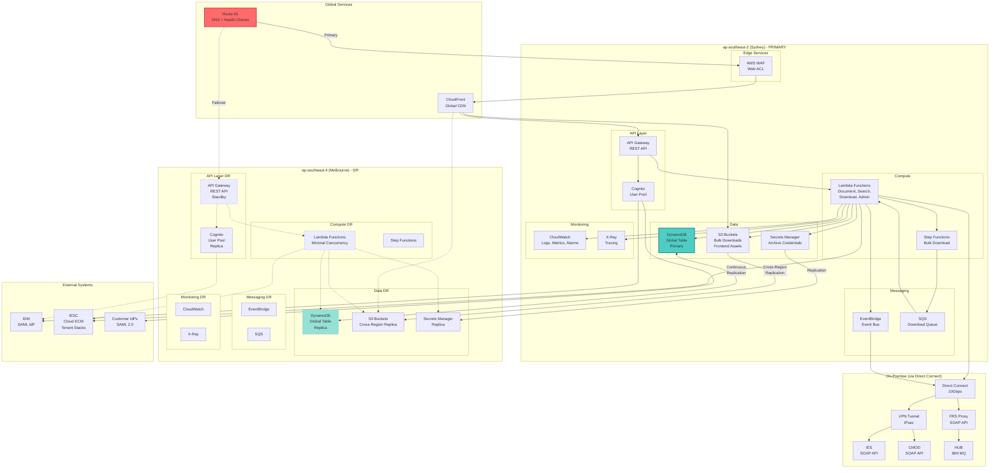
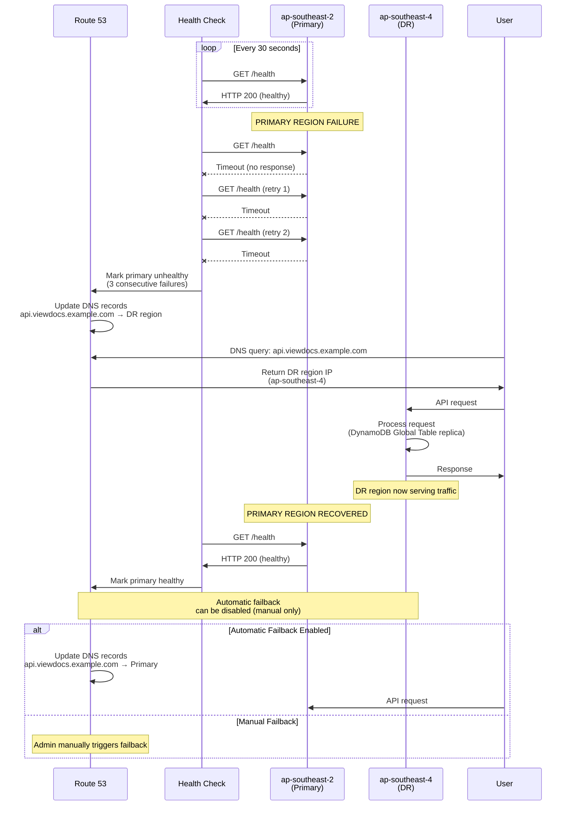
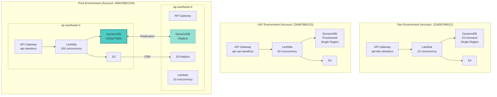
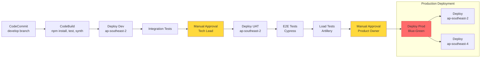
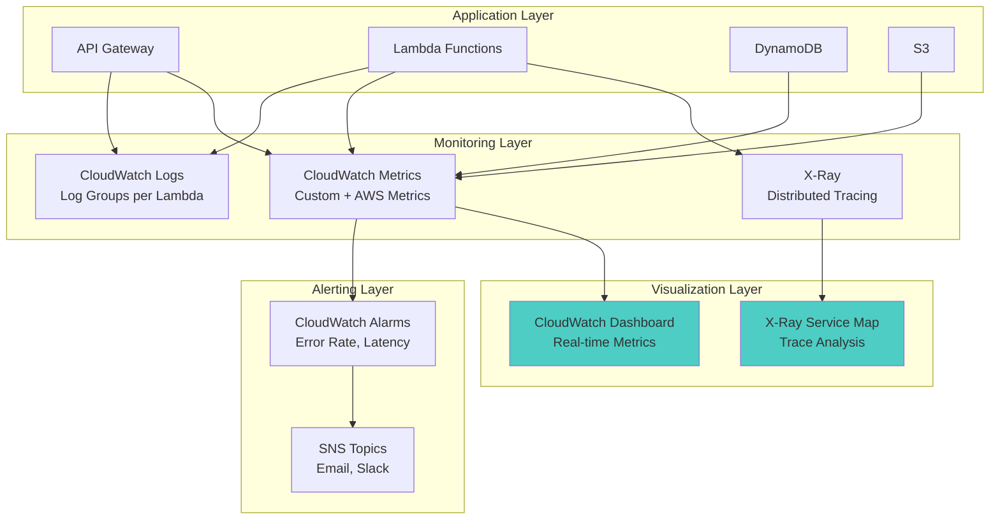

# Deployment Topology Diagram

**Document Version:** 1.0
**Last Updated:** 2025-11-09

This document shows the multi-region deployment topology for Viewdocs Cloud with disaster recovery configuration.

---

## 1. Multi-Region Deployment Architecture

### 1.1 Primary and DR Regions



---

## 2. Deployment Layers

### 2.1 Layer Breakdown

| Layer | Primary Region | DR Region | Replication |
|-------|----------------|-----------|-------------|
| **Global Services** | Route 53, CloudFront | Same (global) | N/A |
| **Edge Security** | WAF (ap-southeast-2) | WAF (ap-southeast-4) | Manual config sync |
| **API Layer** | API Gateway, Cognito | API Gateway, Cognito | Manual deployment |
| **Compute** | Lambda (100 concurrency) | Lambda (10 concurrency) | CDK deployment |
| **Data** | DynamoDB (primary), S3 | DynamoDB (replica), S3 (replica) | Automatic (Global Tables, CRR) |
| **Secrets** | Secrets Manager | Secrets Manager (replica) | Automatic |
| **Messaging** | EventBridge, SQS | EventBridge, SQS | Manual deployment |
| **Monitoring** | CloudWatch, X-Ray | CloudWatch, X-Ray | Independent |

---

## 3. Multi-Region Failover

### 3.1 Health Check Configuration

**Route 53 Health Check**:
- **Endpoint**: `https://api.viewdocs.example.com/health`
- **Protocol**: HTTPS
- **Port**: 443
- **Path**: `/health`
- **Interval**: 30 seconds
- **Failure Threshold**: 3 consecutive failures (90 seconds)
- **Regions**: 3 different AWS regions monitoring endpoint

**Health Check Lambda**:
```typescript
export async function healthHandler(): Promise<APIGatewayProxyResult> {
  try {
    // Check DynamoDB
    await dynamoDb.getItem({
      TableName: 'viewdocs-data',
      Key: { PK: 'HEALTH', SK: 'CHECK' }
    }).promise();

    // Check Cognito
    await cognito.describeUserPool({ UserPoolId }).promise();

    return {
      statusCode: 200,
      body: JSON.stringify({
        status: 'healthy',
        region: process.env.AWS_REGION,
        timestamp: new Date().toISOString()
      })
    };
  } catch (error) {
    return {
      statusCode: 503,
      body: JSON.stringify({ status: 'unhealthy', error: error.message })
    };
  }
}
```

### 3.2 Failover Sequence



**Failover Time**:
- Health check failure detection: 90 seconds (3 × 30s)
- DNS propagation: 60 seconds (TTL)
- **Total RTO**: ~2.5 minutes

---

## 4. Deployment Environments

### 4.1 Environment Topology



**Key Differences**:
- **Dev**: On-demand DynamoDB, single region, no DR
- **UAT**: Provisioned DynamoDB, single region, no DR
- **Prod**: Provisioned + auto-scaling, Global Tables, full DR

---

## 5. Network Topology

### 5.1 On-Premise Connectivity

```mermaid
graph LR
    subgraph "AWS - ap-southeast-2"
        subgraph "VPC (Optional)"
            PrivateSubnet[Private Subnet<br/>Lambda ENI]
            NAT[NAT Gateway<br/>Public Subnet]
        end

        Lambda[Lambda Functions]
        DXGateway[Direct Connect Gateway]
    end

    subgraph "AWS Direct Connect Location"
        DXConnection[Direct Connect<br/>10Gbps Connection]
    end

    subgraph "On-Premise Data Center"
        Router[Border Router]
        Firewall[Firewall]
        IES[IES Server<br/>SOAP API]
        CMOD[CMOD Server<br/>SOAP API]
        FRS[FRS Proxy<br/>SOAP API]
        HUB[HUB<br/>IBM MQ]
    end

    Lambda -->|If VPC Lambda| PrivateSubnet
    PrivateSubnet --> NAT
    NAT --> DXGateway
    Lambda -->|Direct (no VPC)| DXGateway

    DXGateway --> DXConnection
    DXConnection --> Router
    Router --> Firewall
    Firewall --> IES
    Firewall --> CMOD
    Firewall --> FRS
    FRS --> HUB

    style DXConnection fill:#FF6B6B,stroke:#C92A2A
    style Lambda fill:#4ECDC4
```

**Connectivity Options**:

| Option | Pros | Cons | Recommendation |
|--------|------|------|----------------|
| **Lambda in VPC** | Private IP connectivity, enhanced security | NAT costs ($45/AZ/month), cold start penalty (+2s) | Use if required by on-premise network policies |
| **Lambda without VPC** | No NAT costs, faster cold starts | Public IP connectivity (still encrypted via TLS/IPsec) | **Recommended** if Direct Connect supports public IPs |

---

## 6. Deployment Pipeline Topology

### 6.1 CI/CD Pipeline Flow



---

## 7. Monitoring & Observability Topology

### 7.1 Centralized Monitoring



---

## Next Steps

1. Review deployment topology with infrastructure team
2. Test failover procedure in UAT environment
3. Configure Route 53 health checks
4. Set up Direct Connect connectivity
5. Create runbook for manual failover procedure

---

**Document Control**

| Version | Date | Author | Changes |
|---------|------|--------|---------|
| 1.0 | 2025-11-09 | Infrastructure Team | Initial deployment topology |
