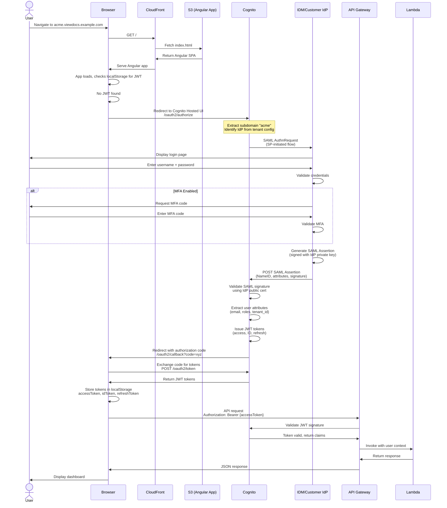
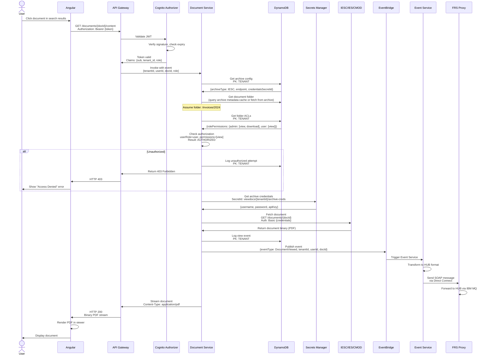
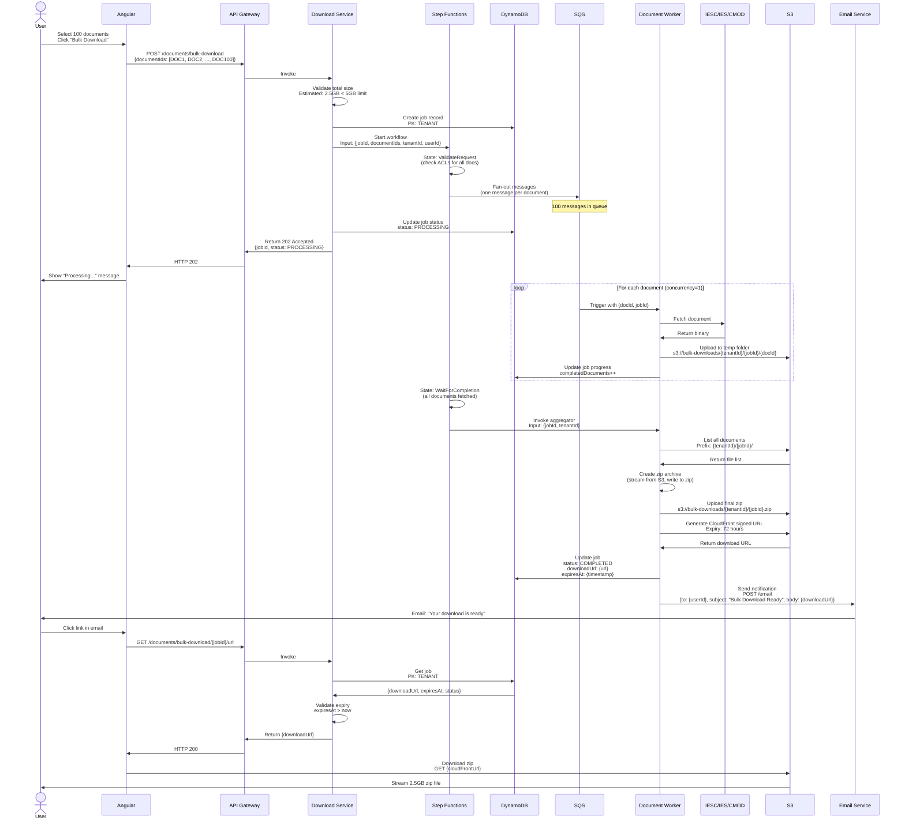
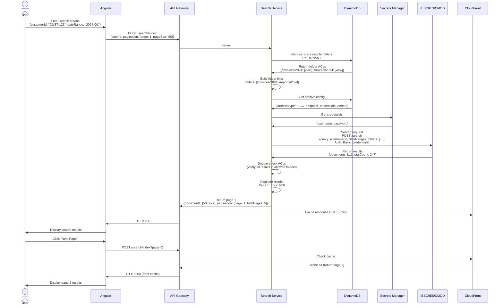
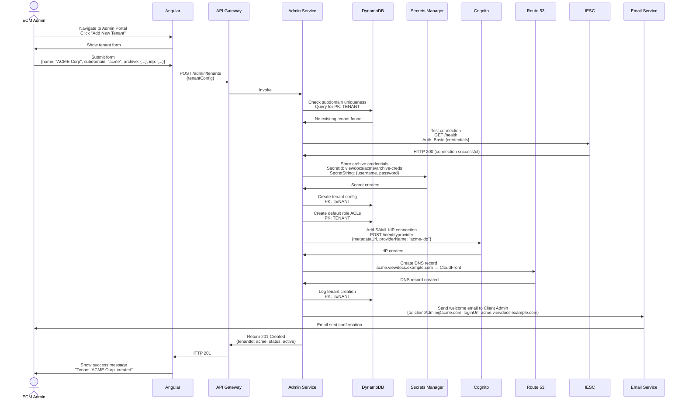
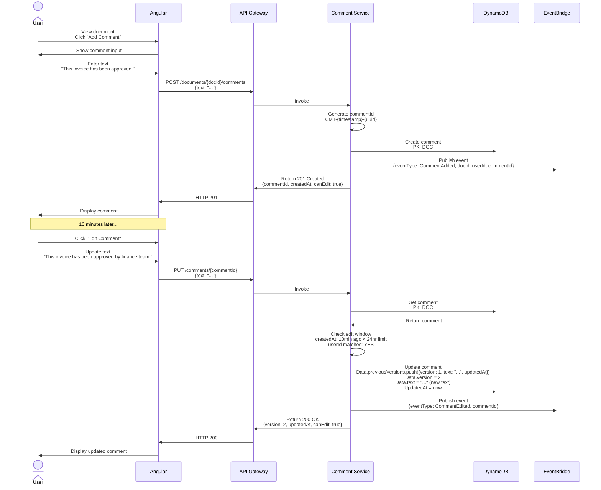

# Sequence Diagrams - Key Application Flows

**Document Version:** 1.0
**Last Updated:** 2025-11-09

This document contains detailed sequence diagrams for critical user flows in the Viewdocs Cloud system.

---

## 1. Authentication Flow (SAML 2.0)

### 1.1 User Login with SAML

**Key Points**:
- SP-initiated flow (user starts at Viewdocs, not IdP)
- Cognito validates SAML assertion signature
- JWT tokens stored in browser localStorage
- Access token expires in 30 minutes (configurable)

---

## 2. Document View Flow

### 2.1 User Views Document from Archive

**Key Points**:
- Authorization checked before fetching document
- Archive credentials fetched from Secrets Manager
- All actions logged to DynamoDB audit table
- Events published to EventBridge for HUB integration

---

## 3. Bulk Download Flow

### 3.1 Async Bulk Download with Email Notification

**Key Points**:
- Async processing with Step Functions orchestration
- One Lambda per document (concurrency=1 to avoid overwhelming archive)
- Documents stored temporarily in S3
- Email notification sent when ready
- Download URL expires after 72 hours (lifecycle policy deletes files)

---

## 4. Search Flow

### 4.1 Index-Based Search with ACL Filtering

**Key Points**:
- Folder ACLs fetched from DynamoDB before search
- Search filtered by user's accessible folders
- Results double-checked for ACL compliance
- CloudFront caches search results (5 min TTL)

---

## 5. Admin Tenant Onboarding Flow

### 5.1 ECM Admin Creates New Tenant

**Key Points**:
- Subdomain uniqueness validated
- Archive connection tested before creation
- Credentials stored in Secrets Manager (never in DynamoDB)
- SAML IdP connection configured in Cognito
- DNS record created for tenant subdomain
- Welcome email sent to Client Admin

---

## 6. Comment Workflow

### 6.1 Add Comment with Version History

**Key Points**:
- Comments stored in DynamoDB (not in archive)
- Edit window: 24 hours from creation
- Version history tracked in `previousVersions` array
- Only comment owner can edit
- All comment actions logged to EventBridge

---

## Next Steps

1. Use these diagrams for developer onboarding
2. Update sequence diagrams when flows change
3. Create draw.io versions with AWS icons for presentations
4. Add error scenario sequences (archive timeout, ACL denial, etc.)

---

**Document Control**

| Version | Date | Author | Changes |
|---------|------|--------|---------|
| 1.0 | 2025-11-09 | Architecture Team | Initial sequence diagrams |
